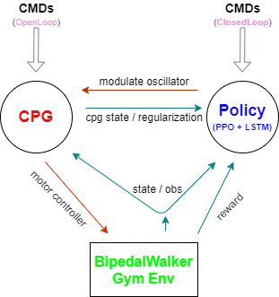
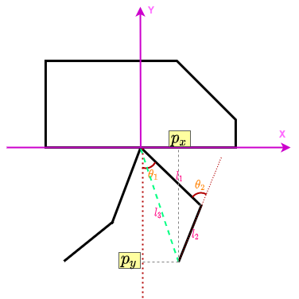

+++
title = "BipedalWalker Demo: Experiments with CPG-based RL"
date = "2024-12-06"

[taxonomies]
tags=["CPG", "RL", "DRL", "BipedalWalker", "Bipedal", "Biped"]

[extra]
comment = true
+++

## Background

In the previous blog, we provided a brief introduction to central pattern generators (CPGs) and how they can be used as quadrupedal locomotion controllers. CPG-based methods offer advantages such as parameterizable gait behavior generation, dynamic motion pattern adjustment on the fly, etc. Therefore it is interesting to see how this method performs when applied to bipedal robots.

<video width="auto" oncontextmenu="return false;" nocontrols autoplay loop muted disablepictureinpicture preload=metadata>
    <source src="{{ url(path="vids/cpg_patterns/eval_freq.0.3-0.9_heit.1.8_sl.0.48_gcgp.0.18.0.08-episode-0_crop.webm") }}" type="video/webm">
    Your browser does not support the video tag.
</video>
&nbsp;&nbsp;&nbsp;
<video width="40%" oncontextmenu="return false;" nocontrols autoplay loop muted disablepictureinpicture preload=metadata>
    <source src="{{ url(path="vids/cpg_rl/f8_cpg.mp4") }}" type="video/mp4">
    Your browser does not support the video tag.
</video>

<!-- more -->

## Introduction

There are some differences that should be noted when porting CPG from quadrupedal robots to bipedal robots, i.e.,

- Balance Maintenance: quadrupeds are generally easier to maintain balance than bipeds because of their wider base of support, lower center of gravity, function redundancy from four legs, etc.
- CPG Model Parameters: For 3D quadrupedal robots, there are 12-DOF control variables from all joints, corresponding to 12 CPG parameters for 3D movement. However for 2D bipedal robots, there are only 4 joints to control for locomotion, is it enough to use just 4 CPG parameters to accomplish self-locomotion tasks?
- Training Environment: many CPG-based algorithms are trained on flat terrain since uneven ground has big impact on CPG's intrinsic rhythm and makes the training process more unstable. But here we choose Gym BipedalWalker which bases on Box2d physical engine, because it is more engaging and can meanwhile help to reveal the CPG's performance in difficult scenarios.

The system is mainly composed of three components: the CPG module, the RL(PPO) pipeline, and the Gym Environment. The overall architecture diagram is as follows,

<figure>
    
    <figcaption>
    </figcaption>
</figure>

## Methods

In this blog a modified CPG model used for BipedWalker is as follows:


$$
\left\{
\begin{align}
    \ddot{r}_t &= a \left( \frac{a}{4} \left( \mu_t - r_t \right) - \dot{r}_t \right) \\
    \dot{\theta}_t &= \omega_t + \omega^b \\
\end{align}
\right.
$$


where $r_t$ is the current amplitude of the oscillator, $\theta_t$ is the current phase of the oscillator, $\mu_t$ is the intrinsic amplitude, $\omega_t$ is the adaptive frequency of environment, $\omega_b$ is the base movement frequency for all limbs, $a$ is a positive constant controlling the convergence speed of amplitude.

Then the following transformation is used to convert each leg's CPG outputs to its corresponding foot's Cartesian position:


$$
\left\{
\begin{align}
    p_{x,t} &= -d_{\text{step}} (r_t - 1) \cos (\theta_t) \\
    p_{z,t} &= \begin{cases}
        -h + g_c \sin(\theta_t) & \text{if} \sin(\theta_t) \ge 0 \\
        -h + g_p \sin(\theta_t) & \text{if} \sin(\theta_t) \lt 0 \\
    \end{cases} \\
\end{align}
\right.
$$


Finally a PD controller is used to output torque for each joint, where the required targets of PD are obtained via inverse kinematics from foot Cartesian positions to joint angles:

<figure>
    
    <figcaption>
    </figcaption>
</figure>


$$
\left\{
\begin{align}
    l_3 &= \sqrt{p_x^2 + p_y^2} \\
    \theta_1 &= \arctan\frac{p_x}{p_y} + \arccos\frac{l_1^2 + l_3^2 - l_2^2}{2l_1l_3} \\
    \theta_2 &= -\arccos\frac{l_3^2 - l_1^2 - l_2^2}{2l_1l_2} \\
\end{align}
\right.
$$


if $l_1 = l_2 \triangleq l$, like in gym BipedalWalker environment, above equations can be reduced/simplified to:


$$
\left\{
\begin{align}
    l_3 &= \sqrt{p_x^2 + p_y^2} \\
    \theta_1 &= \arctan\frac{p_x}{p_y} + \arccos\frac{l_3}{2l} \\
    \theta_2 &= -2 \arccos\frac{l_3}{2l} \\
\end{align}
\right.
$$


## CPG Patterns

Here we illustrate some CPG patterns for the Gym BipedalWalker with different parameters, generated using different parameter combinations of frequency, hull height, step length, and ground clearance.

- **Swing Frequency** vs **Hull Height**

    <table width="100%" border="1" bgcolor="#ffffff">
        <colgroup>
            <col width="5%"><col width="5%">
            <col width="5%"><col width="5%">
            <col width="5%"><col width="5%">
            <col width="5%"><col width="5%">
            <col width="5%"><col width="5%">
            <col width="5%"><col width="5%">
            <col width="5%"><col width="5%">
            <col width="5%"><col width="5%">
            <col width="5%"><col width="5%">
            <col width="5%"><col width="5%">
        </colgroup>
        <tr>
            <th colspan=2 style="text-align:center;vertical-align:middle;"></th>
            <th colspan=6 style="text-align:center;vertical-align:middle;">heit=1.7</th>
            <th colspan=6 style="text-align:center;vertical-align:middle;">heit=1.8</th>
            <th colspan=6 style="text-align:center;vertical-align:middle;">heit=1.9</th>
        </tr>
        <tr>
            <th colspan=2 style="text-align:center;vertical-align:middle;">$\omega$=0.2</th>
            <td colspan=6>
            <video src="vids/cpg_patterns/heit_freq/eval_freq.0.2_heit.1.7_sl.0.60_gcgp.0.20.0.06-episode-0_crop.webm" type="video/mp4" width=90% autoplay loop muted/>
            </td>
            <td colspan=6>
            <video src="vids/cpg_patterns/heit_freq/eval_freq.0.2_heit.1.8_sl.0.60_gcgp.0.20.0.06-episode-0_crop.webm" type="video/mp4" width=90% autoplay loop muted/>
            </td>
            <td colspan=6>
            <video src="vids/cpg_patterns/heit_freq/eval_freq.0.2_heit.1.9_sl.0.60_gcgp.0.20.0.06-episode-0_crop.webm" type="video/mp4" width=90% autoplay loop muted/>
            </td>
        </tr>
        <tr>
            <th colspan=2 style="text-align:center;vertical-align:middle;">$\omega$=0.5</th>
            <td colspan=6>
            <video src="vids/cpg_patterns/heit_freq/eval_freq.0.5_heit.1.7_sl.0.60_gcgp.0.20.0.06-episode-0_crop.webm" type="video/mp4" width=90% autoplay loop muted/>
            </td>
            <td colspan=6>
            <video src="vids/cpg_patterns/heit_freq/eval_freq.0.5_heit.1.8_sl.0.60_gcgp.0.20.0.06-episode-0_crop.webm" type="video/mp4" width=90% autoplay loop muted/>
            </td>
            <td colspan=6>
            <video src="vids/cpg_patterns/heit_freq/eval_freq.0.5_heit.1.9_sl.0.60_gcgp.0.20.0.06-episode-0_crop.webm" type="video/mp4" width=90% autoplay loop muted/>
            </td>
        </tr>
        <tr>
            <th colspan=2 style="text-align:center;vertical-align:middle;">$\omega$=1.0</th>
            <td colspan=6>
            <video src="vids/cpg_patterns/heit_freq/eval_freq.1.0_heit.1.7_sl.0.60_gcgp.0.20.0.06-episode-0_crop.webm" type="video/mp4" width=90% autoplay loop muted/>
            </td>
            <td colspan=6>
            <video src="vids/cpg_patterns/heit_freq/eval_freq.1.0_heit.1.8_sl.0.60_gcgp.0.20.0.06-episode-0_crop.webm" type="video/mp4" width=90% autoplay loop muted/>
            </td>
            <td colspan=6>
            <video src="vids/cpg_patterns/heit_freq/eval_freq.1.0_heit.1.9_sl.0.60_gcgp.0.20.0.06-episode-0_crop.webm" type="video/mp4" width=90% autoplay loop muted/>
            </td>
        </tr>
    </table>

- **Step Length** vs **Swing Frequency**

    <table width="100%" border="1" bgcolor="#ffffff">
        <colgroup>
            <col width="5%"><col width="5%">
            <col width="5%"><col width="5%">
            <col width="5%"><col width="5%">
            <col width="5%"><col width="5%">
            <col width="5%"><col width="5%">
            <col width="5%"><col width="5%">
            <col width="5%"><col width="5%">
            <col width="5%"><col width="5%">
            <col width="5%"><col width="5%">
            <col width="5%"><col width="5%">
        </colgroup>
        <tr>
            <th colspan=2 style="text-align:center;vertical-align:middle;"></th>
            <th colspan=6 style="text-align:center;vertical-align:middle;">$\omega$=0.2</th>
            <th colspan=6 style="text-align:center;vertical-align:middle;">$\omega$=0.5</th>
            <th colspan=6 style="text-align:center;vertical-align:middle;">$\omega$=1.0</th>
        </tr>
        <tr>
            <th colspan=2 style="text-align:center;vertical-align:middle;">sl=0.4</th>
            <td colspan=6>
            <video src="vids/cpg_patterns/sl_freq/eval_freq.0.2_heit.1.8_sl.0.40_gcgp.0.20.0.06-episode-0_crop.webm" type="video/mp4" width=90% autoplay loop muted/>
            </td>
            <td colspan=6>
            <video src="vids/cpg_patterns/sl_freq/eval_freq.0.5_heit.1.8_sl.0.40_gcgp.0.20.0.06-episode-0_crop.webm" type="video/mp4" width=90% autoplay loop muted/>
            </td>
            <td colspan=6>
            <video src="vids/cpg_patterns/sl_freq/eval_freq.1.0_heit.1.8_sl.0.40_gcgp.0.20.0.06-episode-0_crop.webm" type="video/mp4" width=90% autoplay loop muted/>
            </td>
        </tr>
        <tr>
            <th colspan=2 style="text-align:center;vertical-align:middle;">sl=0.8</th>
            <td colspan=6>
            <video src="vids/cpg_patterns/sl_freq/eval_freq.0.2_heit.1.8_sl.0.80_gcgp.0.20.0.06-episode-0_crop.webm" type="video/mp4" width=90% autoplay loop muted/>
            </td>
            <td colspan=6>
            <video src="vids/cpg_patterns/sl_freq/eval_freq.0.5_heit.1.8_sl.0.80_gcgp.0.20.0.06-episode-0_crop.webm" type="video/mp4" width=90% autoplay loop muted/>
            </td>
            <td colspan=6>
            <video src="vids/cpg_patterns/sl_freq/eval_freq.1.0_heit.1.8_sl.0.80_gcgp.0.20.0.06-episode-0_crop.webm" type="video/mp4" width=90% autoplay loop muted/>
            </td>
        </tr>
    </table>

- **Step Length** vs **Hull Height**

    <table width="100%" border="1" bgcolor="#ffffff">
        <colgroup>
            <col width="5%"><col width="5%">
            <col width="5%"><col width="5%">
            <col width="5%"><col width="5%">
            <col width="5%"><col width="5%">
            <col width="5%"><col width="5%">
            <col width="5%"><col width="5%">
            <col width="5%"><col width="5%">
            <col width="5%"><col width="5%">
            <col width="5%"><col width="5%">
            <col width="5%"><col width="5%">
        </colgroup>
        <tr>
            <th colspan=2 style="text-align:center;vertical-align:middle;"></th>
            <th colspan=6 style="text-align:center;vertical-align:middle;">heit=1.7</th>
            <th colspan=6 style="text-align:center;vertical-align:middle;">heit=1.8</th>
            <th colspan=6 style="text-align:center;vertical-align:middle;">heit=1.9</th>
        </tr>
        <tr>
            <th colspan=2 style="text-align:center;vertical-align:middle;">sl=0.4</th>
            <td colspan=6>
            <video src="vids/cpg_patterns/sl_heit/eval_freq.0.5_heit.1.7_sl.0.40_gcgp.0.20.0.06-episode-0_crop.webm" type="video/mp4" width=90% autoplay loop muted/>
            </td>
            <td colspan=6>
            <video src="vids/cpg_patterns/sl_heit/eval_freq.0.5_heit.1.8_sl.0.40_gcgp.0.20.0.06-episode-0_crop.webm" type="video/mp4" width=90% autoplay loop muted/>
            </td>
            <td colspan=6>
            <video src="vids/cpg_patterns/sl_heit/eval_freq.0.5_heit.1.9_sl.0.40_gcgp.0.20.0.06-episode-0_crop.webm" type="video/mp4" width=90% autoplay loop muted/>
            </td>
        </tr>
        <tr>
            <th colspan=2 style="text-align:center;vertical-align:middle;">sl=0.8</th>
            <td colspan=6>
            <video src="vids/cpg_patterns/sl_heit/eval_freq.0.5_heit.1.7_sl.0.80_gcgp.0.20.0.06-episode-0_crop.webm" type="video/mp4" width=90% autoplay loop muted/>
            </td>
            <td colspan=6>
            <video src="vids/cpg_patterns/sl_heit/eval_freq.0.5_heit.1.8_sl.0.80_gcgp.0.20.0.06-episode-0_crop.webm" type="video/mp4" width=90% autoplay loop muted/>
            </td>
            <td colspan=6>
            <video src="vids/cpg_patterns/sl_heit/eval_freq.0.5_heit.1.9_sl.0.80_gcgp.0.20.0.06-episode-0_crop.webm" type="video/mp4" width=90% autoplay loop muted/>
            </td>
        </tr>
    </table>

- **Ground Clearance** vs **Step Length**

    <table width="100%" border="1" bgcolor="#ffffff">
        <colgroup>
            <col width="5%"><col width="5%">
            <col width="5%"><col width="5%">
            <col width="5%"><col width="5%">
            <col width="5%"><col width="5%">
            <col width="5%"><col width="5%">
            <col width="5%"><col width="5%">
            <col width="5%"><col width="5%">
            <col width="5%"><col width="5%">
            <col width="5%"><col width="5%">
            <col width="5%"><col width="5%">
        </colgroup>
        <tr>
            <th colspan=2 style="text-align:center;vertical-align:middle;"></th>
            <th colspan=6 style="text-align:center;vertical-align:middle;">gc=0.1</th>
            <th colspan=6 style="text-align:center;vertical-align:middle;">gc=0.2</th>
        </tr>
        <tr>
            <th colspan=2 style="text-align:center;vertical-align:middle;">sl=0.4</th>
            <td colspan=6>
            <video src="vids/cpg_patterns/gc_sl/eval_freq.0.5_heit.1.8_sl.0.40_gcgp.0.10.0.03-episode-0_crop.webm" type="video/mp4" width=90% autoplay loop muted/>
            </td>
            <td colspan=6>
            <video src="vids/cpg_patterns/gc_sl/eval_freq.0.5_heit.1.8_sl.0.40_gcgp.0.20.0.06-episode-0_crop.webm" type="video/mp4" width=90% autoplay loop muted/>
            </td>
        </tr>
        <tr>
            <th colspan=2 style="text-align:center;vertical-align:middle;">sl=0.8</th>
            <td colspan=6>
            <video src="vids/cpg_patterns/gc_sl/eval_freq.0.5_heit.1.8_sl.0.80_gcgp.0.10.0.03-episode-0_crop.webm" type="video/mp4" width=90% autoplay loop muted/>
            </td>
            <td colspan=6>
            <video src="vids/cpg_patterns/gc_sl/eval_freq.0.5_heit.1.8_sl.0.80_gcgp.0.20.0.06-episode-0_crop.webm" type="video/mp4" width=90% autoplay loop muted/>
            </td>
        </tr>
    </table>

## Results

<!-- - **Training Efficiency** -->

- **Evaluation Samples**

    - ***Fixed Body Height***
    

    

        <video src="vids/cpg_rl/f8_cpg.mp4" width=auto oncontextmenu="return false;" controls autoplay loop muted disablepictureinpicture preload=metadata/>
    

    

        <video src="vids/cpg_rl/h1.8.mp4" width=auto oncontextmenu="return false;" controls autoplay loop muted disablepictureinpicture preload=metadata/>
    

    

    - ***Body Height Adjustment On-the-fly***
    

    

        <video src="vids/adjust_height_f7_p1.5d0.1.webm" width=auto oncontextmenu="return false;" controls autoplay loop muted disablepictureinpicture preload=metadata/>
    

    

## Funny Shots

    <video width="40%" src="vids/funny_shots/single_leg.mp4" oncontextmenu="return false;" controls autoplay loop muted disablepictureinpicture preload=metadata>
    </video>
    <video width="40%" src="vids/funny_shots/single_leg_ht1.9.mp4" oncontextmenu="return false;" controls autoplay loop muted disablepictureinpicture preload=metadata>
    </video>
    <video width="40%" src="vids/funny_shots/f10_cpg_jump.mp4" oncontextmenu="return false;" controls autoplay loop muted disablepictureinpicture preload=metadata>
    </video>
    <video width="40%" src="vids/funny_shots/f30_cpg_jump_fancy.mp4" oncontextmenu="return false;" controls autoplay loop muted disablepictureinpicture preload=metadata>
    </video>
    <video width="40%" src="vids/funny_shots/bs256_nenv128_gc_jump.mp4" oncontextmenu="return false;" controls autoplay loop muted disablepictureinpicture preload=metadata>
    </video>
    <video width="40%" src="vids/funny_shots/raw_1.mp4" oncontextmenu="return false;" controls autoplay loop muted disablepictureinpicture preload=metadata>
    </video>
    <video width="40%" src="vids/funny_shots/raw_4.mp4" oncontextmenu="return false;" controls autoplay loop muted disablepictureinpicture preload=metadata>
    </video>
    <video width="40%" src="vids/funny_shots/f100_cpg_mincing_step.mp4" oncontextmenu="return false;" controls autoplay loop muted disablepictureinpicture preload=metadata>
    </video>
    <video width="40%" src="vids/funny_shots/walk_head_down.mp4" oncontextmenu="return false;" controls autoplay loop muted disablepictureinpicture preload=metadata>
    </video>
    <video width="40%" src="vids/funny_shots/walk_head_up.mp4" oncontextmenu="return false;" controls autoplay loop muted disablepictureinpicture preload=metadata>
    </video>

