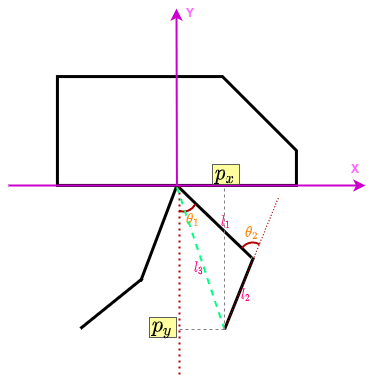

+++
title = "BipedalWalker Demo: Experiments with CPG-based RL"
date = "2024-12-06"

[taxonomies]
tags=["CPG", "RL", "DRL", "BipedalWalker", "Bipedal", "Biped"]

[extra]
comment = true
+++

## Background

In previous blog we gived a brief introduction about what is CPG(central pattern generator), and how it can be used as a quadrupedal locomotion controller. CPG-based method has some advantages like parameterizable gait behavior generation, dynamic motion pattern adjustment on the fly, etc. So it's interesting to see how this method will behave when applied to bipedal robot.

<video width="auto" oncontextmenu="return false;" nocontrols autoplay loop muted disablepictureinpicture preload=metadata>
    <source src="{{ url(path="vids/cpg_patterns/eval_freq.0.3-0.9_heit.1.8_sl.0.48_gcgp.0.18.0.08-episode-0_crop.webm") }}" type="video/webm">
    Your browser does not support the video tag.
</video>

<!-- more -->

## Introduction

There are some differences should be noticed when porting CPG from quadrupedal robot to bipedal robot, i.e.,

- balance keeping: quadrupeds are generally easier to maintain balance than bipeds because of their wider base of support, lower center of gravity, function redundancy from four legs, etc.
- CPG model parameters: For quadrupedal robot, there are 12-DOF control variables from all joints, and corresponds to 12 CPG parameters for 3D movement, while for bipedal robot, there are only 4 joints to control for locomotion, is it enough to just use 4 CPG parameters to accomplish self-locomotion tasks?
- training environment: many CPG-based algorithms are trained on flat ground since uneven ground has big impact on CPG's intrinsic rhythmic and makes the training process more unstable. But here we choose gym BipedalWalker which bases on Box2d physical engine, cause it's more fun and can meanwhile help to reveal CPG's performance in difficult scenarios.

## Methods

In this blog a modified CPG model is used for BipedWalker as follows:


$$
\left\{
\begin{align}
    \ddot{r}_t &= a \left( \frac{a}{4} \left( \mu_t - r_t \right) - \dot{r}_t \right) \\
    \dot{\theta}_t &= \omega_t + \omega^b \\
\end{align}
\right.
$$


where $r_t$ is the current amplitude of the oscillator, $\theta_t$ is the current phase of the oscillator, $\mu_t$ is the intrinsic amplitude, $\omega_t$ is the adaptive frequency of environment, $\omega_b$ is the base movement frequency for all limbs, $a$ is a positive constant controlling the convergence speed of amplitude.

Then the following transformation is used to convert each leg's CPG outputs to its corresponding foot's Cartesian positions:


$$
\left\{
\begin{align}
    p_{x,t} &= -d_{\text{step}} (r_t - 1) \cos (\theta_t) \\
    p_{z,t} &= \begin{cases}
        -h + g_c \sin(\theta_t) & \text{if} \sin(\theta_t) \ge 0 \\
        -h + g_p \sin(\theta_t) & \text{if} \sin(\theta_t) \lt 0 \\
    \end{cases} \\
\end{align}
\right.
$$


Finally a PD controller is used to output torque for each joint, where the required target of PD are obtained via the inverse kinematics from foot Cartesian positions to joint angles:

<figure>
    
    <figcaption>
    </figcaption>
</figure>


$$
\left\{
\begin{align}
    l_3 &= \sqrt{p_x^2 + p_y^2} \\
    \theta_1 &= \arctan\frac{p_x}{p_y} + \arccos\frac{l_1^2 + l_3^2 - l_2^2}{2l_1l_3} \\
    \theta_2 &= -\arccos\frac{l_3^2 - l_1^2 - l_2^2}{2l_1l_2} \\
\end{align}
\right.
$$


if $l_1 = l_2 \triangleq l$, like in gym BipedalWalker environment, above equations can be reduced/simplified to:


$$
\left\{
\begin{align}
    l_3 &= \sqrt{p_x^2 + p_y^2} \\
    \theta_1 &= \arctan\frac{p_x}{p_y} + \arccos\frac{l_3}{2l} \\
    \theta_2 &= -2 \arccos\frac{l_3}{2l} \\
\end{align}
\right.
$$


## CPG Patterns

Here we illustrate some CPG patterns for gym BipedalWalker with different parameters, from different combinations of frequency, hull height, step length, ground clearance.

- **Swing Frequency** vs **Hull Height**

    <table width="100%" border="1" bgcolor="#ffffff">
        <colgroup>
            <col width="5%"><col width="5%">
            <col width="5%"><col width="5%">
            <col width="5%"><col width="5%">
            <col width="5%"><col width="5%">
            <col width="5%"><col width="5%">
            <col width="5%"><col width="5%">
            <col width="5%"><col width="5%">
            <col width="5%"><col width="5%">
            <col width="5%"><col width="5%">
            <col width="5%"><col width="5%">
        </colgroup>
        <tr>
            <th colspan=2 style="text-align:center;vertical-align:middle;"></th>
            <th colspan=6 style="text-align:center;vertical-align:middle;">heit=1.7</th>
            <th colspan=6 style="text-align:center;vertical-align:middle;">heit=1.8</th>
            <th colspan=6 style="text-align:center;vertical-align:middle;">heit=1.9</th>
        </tr>
        <tr>
            <th colspan=2 style="text-align:center;vertical-align:middle;">$\omega$=0.2</th>
            <td colspan=6>
            <video src="vids/cpg_patterns/heit_freq/eval_freq.0.2_heit.1.7_sl.0.60_gcgp.0.20.0.06-episode-0_crop.webm" type="video/mp4" width=90% autoplay loop muted/>
            </td>
            <td colspan=6>
            <video src="vids/cpg_patterns/heit_freq/eval_freq.0.2_heit.1.8_sl.0.60_gcgp.0.20.0.06-episode-0_crop.webm" type="video/mp4" width=90% autoplay loop muted/>
            </td>
            <td colspan=6>
            <video src="vids/cpg_patterns/heit_freq/eval_freq.0.2_heit.1.9_sl.0.60_gcgp.0.20.0.06-episode-0_crop.webm" type="video/mp4" width=90% autoplay loop muted/>
            </td>
        </tr>
        <tr>
            <th colspan=2 style="text-align:center;vertical-align:middle;">$\omega$=0.5</th>
            <td colspan=6>
            <video src="vids/cpg_patterns/heit_freq/eval_freq.0.5_heit.1.7_sl.0.60_gcgp.0.20.0.06-episode-0_crop.webm" type="video/mp4" width=90% autoplay loop muted/>
            </td>
            <td colspan=6>
            <video src="vids/cpg_patterns/heit_freq/eval_freq.0.5_heit.1.8_sl.0.60_gcgp.0.20.0.06-episode-0_crop.webm" type="video/mp4" width=90% autoplay loop muted/>
            </td>
            <td colspan=6>
            <video src="vids/cpg_patterns/heit_freq/eval_freq.0.5_heit.1.9_sl.0.60_gcgp.0.20.0.06-episode-0_crop.webm" type="video/mp4" width=90% autoplay loop muted/>
            </td>
        </tr>
        <tr>
            <th colspan=2 style="text-align:center;vertical-align:middle;">$\omega$=1.0</th>
            <td colspan=6>
            <video src="vids/cpg_patterns/heit_freq/eval_freq.1.0_heit.1.7_sl.0.60_gcgp.0.20.0.06-episode-0_crop.webm" type="video/mp4" width=90% autoplay loop muted/>
            </td>
            <td colspan=6>
            <video src="vids/cpg_patterns/heit_freq/eval_freq.1.0_heit.1.8_sl.0.60_gcgp.0.20.0.06-episode-0_crop.webm" type="video/mp4" width=90% autoplay loop muted/>
            </td>
            <td colspan=6>
            <video src="vids/cpg_patterns/heit_freq/eval_freq.1.0_heit.1.9_sl.0.60_gcgp.0.20.0.06-episode-0_crop.webm" type="video/mp4" width=90% autoplay loop muted/>
            </td>
        </tr>
    </table>

- **Step Length** vs **Swing Frequency**

    <table width="100%" border="1" bgcolor="#ffffff">
        <colgroup>
            <col width="5%"><col width="5%">
            <col width="5%"><col width="5%">
            <col width="5%"><col width="5%">
            <col width="5%"><col width="5%">
            <col width="5%"><col width="5%">
            <col width="5%"><col width="5%">
            <col width="5%"><col width="5%">
            <col width="5%"><col width="5%">
            <col width="5%"><col width="5%">
            <col width="5%"><col width="5%">
        </colgroup>
        <tr>
            <th colspan=2 style="text-align:center;vertical-align:middle;"></th>
            <th colspan=6 style="text-align:center;vertical-align:middle;">$\omega$=0.2</th>
            <th colspan=6 style="text-align:center;vertical-align:middle;">$\omega$=0.5</th>
            <th colspan=6 style="text-align:center;vertical-align:middle;">$\omega$=1.0</th>
        </tr>
        <tr>
            <th colspan=2 style="text-align:center;vertical-align:middle;">sl=0.4</th>
            <td colspan=6>
            <video src="vids/cpg_patterns/sl_freq/eval_freq.0.2_heit.1.8_sl.0.40_gcgp.0.20.0.06-episode-0_crop.webm" type="video/mp4" width=90% autoplay loop muted/>
            </td>
            <td colspan=6>
            <video src="vids/cpg_patterns/sl_freq/eval_freq.0.5_heit.1.8_sl.0.40_gcgp.0.20.0.06-episode-0_crop.webm" type="video/mp4" width=90% autoplay loop muted/>
            </td>
            <td colspan=6>
            <video src="vids/cpg_patterns/sl_freq/eval_freq.1.0_heit.1.8_sl.0.40_gcgp.0.20.0.06-episode-0_crop.webm" type="video/mp4" width=90% autoplay loop muted/>
            </td>
        </tr>
        <tr>
            <th colspan=2 style="text-align:center;vertical-align:middle;">sl=0.8</th>
            <td colspan=6>
            <video src="vids/cpg_patterns/sl_freq/eval_freq.0.2_heit.1.8_sl.0.80_gcgp.0.20.0.06-episode-0_crop.webm" type="video/mp4" width=90% autoplay loop muted/>
            </td>
            <td colspan=6>
            <video src="vids/cpg_patterns/sl_freq/eval_freq.0.5_heit.1.8_sl.0.80_gcgp.0.20.0.06-episode-0_crop.webm" type="video/mp4" width=90% autoplay loop muted/>
            </td>
            <td colspan=6>
            <video src="vids/cpg_patterns/sl_freq/eval_freq.1.0_heit.1.8_sl.0.80_gcgp.0.20.0.06-episode-0_crop.webm" type="video/mp4" width=90% autoplay loop muted/>
            </td>
        </tr>
    </table>

- **Step Length** vs **Hull Height**

    <table width="100%" border="1" bgcolor="#ffffff">
        <colgroup>
            <col width="5%"><col width="5%">
            <col width="5%"><col width="5%">
            <col width="5%"><col width="5%">
            <col width="5%"><col width="5%">
            <col width="5%"><col width="5%">
            <col width="5%"><col width="5%">
            <col width="5%"><col width="5%">
            <col width="5%"><col width="5%">
            <col width="5%"><col width="5%">
            <col width="5%"><col width="5%">
        </colgroup>
        <tr>
            <th colspan=2 style="text-align:center;vertical-align:middle;"></th>
            <th colspan=6 style="text-align:center;vertical-align:middle;">heit=1.7</th>
            <th colspan=6 style="text-align:center;vertical-align:middle;">heit=1.8</th>
            <th colspan=6 style="text-align:center;vertical-align:middle;">heit=1.9</th>
        </tr>
        <tr>
            <th colspan=2 style="text-align:center;vertical-align:middle;">sl=0.4</th>
            <td colspan=6>
            <video src="vids/cpg_patterns/sl_heit/eval_freq.0.5_heit.1.7_sl.0.40_gcgp.0.20.0.06-episode-0_crop.webm" type="video/mp4" width=90% autoplay loop muted/>
            </td>
            <td colspan=6>
            <video src="vids/cpg_patterns/sl_heit/eval_freq.0.5_heit.1.8_sl.0.40_gcgp.0.20.0.06-episode-0_crop.webm" type="video/mp4" width=90% autoplay loop muted/>
            </td>
            <td colspan=6>
            <video src="vids/cpg_patterns/sl_heit/eval_freq.0.5_heit.1.9_sl.0.40_gcgp.0.20.0.06-episode-0_crop.webm" type="video/mp4" width=90% autoplay loop muted/>
            </td>
        </tr>
        <tr>
            <th colspan=2 style="text-align:center;vertical-align:middle;">sl=0.8</th>
            <td colspan=6>
            <video src="vids/cpg_patterns/sl_heit/eval_freq.0.5_heit.1.7_sl.0.80_gcgp.0.20.0.06-episode-0_crop.webm" type="video/mp4" width=90% autoplay loop muted/>
            </td>
            <td colspan=6>
            <video src="vids/cpg_patterns/sl_heit/eval_freq.0.5_heit.1.8_sl.0.80_gcgp.0.20.0.06-episode-0_crop.webm" type="video/mp4" width=90% autoplay loop muted/>
            </td>
            <td colspan=6>
            <video src="vids/cpg_patterns/sl_heit/eval_freq.0.5_heit.1.9_sl.0.80_gcgp.0.20.0.06-episode-0_crop.webm" type="video/mp4" width=90% autoplay loop muted/>
            </td>
        </tr>
    </table>

- **Ground Clearance** vs **Step Length**

    <table width="100%" border="1" bgcolor="#ffffff">
        <colgroup>
            <col width="5%"><col width="5%">
            <col width="5%"><col width="5%">
            <col width="5%"><col width="5%">
            <col width="5%"><col width="5%">
            <col width="5%"><col width="5%">
            <col width="5%"><col width="5%">
            <col width="5%"><col width="5%">
            <col width="5%"><col width="5%">
            <col width="5%"><col width="5%">
            <col width="5%"><col width="5%">
        </colgroup>
        <tr>
            <th colspan=2 style="text-align:center;vertical-align:middle;"></th>
            <th colspan=6 style="text-align:center;vertical-align:middle;">gc=0.1</th>
            <th colspan=6 style="text-align:center;vertical-align:middle;">gc=0.2</th>
        </tr>
        <tr>
            <th colspan=2 style="text-align:center;vertical-align:middle;">sl=0.4</th>
            <td colspan=6>
            <video src="vids/cpg_patterns/gc_sl/eval_freq.0.5_heit.1.8_sl.0.40_gcgp.0.10.0.03-episode-0_crop.webm" type="video/mp4" width=90% autoplay loop muted/>
            </td>
            <td colspan=6>
            <video src="vids/cpg_patterns/gc_sl/eval_freq.0.5_heit.1.8_sl.0.40_gcgp.0.20.0.06-episode-0_crop.webm" type="video/mp4" width=90% autoplay loop muted/>
            </td>
        </tr>
        <tr>
            <th colspan=2 style="text-align:center;vertical-align:middle;">sl=0.8</th>
            <td colspan=6>
            <video src="vids/cpg_patterns/gc_sl/eval_freq.0.5_heit.1.8_sl.0.80_gcgp.0.10.0.03-episode-0_crop.webm" type="video/mp4" width=90% autoplay loop muted/>
            </td>
            <td colspan=6>
            <video src="vids/cpg_patterns/gc_sl/eval_freq.0.5_heit.1.8_sl.0.80_gcgp.0.20.0.06-episode-0_crop.webm" type="video/mp4" width=90% autoplay loop muted/>
            </td>
        </tr>
    </table>

## Results

    **TODO**

## Funny Shots

    **TODO**
