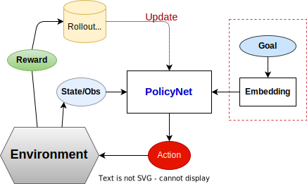

+++
title = "CartPole Demo: Task Extention With Goal-Guided Control"
date = "2024-10-30"
updated = "2024-11-03"

[taxonomies]
tags=["RL", "DRL", "Cartpole"]

[extra]
comment = true
+++

## Background

In previous blog, we solved the CartPole-V1 task which tries to balance the pole upright by applying force in the left and right direction on the cart. Although this task is successfully solved with DQN and PPO, we can't control where the cart should be when the pole is balanced. In this blog we try to solve this goal-guided CartPole task.

<!-- more -->

## Task Definition

The agent has to decide between two actions - moving the cart left or right - so that the pole attached to it stays upright and the cart moves to the goal position specified by user when the system is balanced.

### Rewards

In this task, rewards are `1 - normalized_dist_to_goal` for every incremental timestep and the environment terminates if the pole falls over too far or the cart moves more than 2.4 units away from center.

Since the goal is to keep the pole upright for as long as possible and the cart to the goal position as close as possible, by default, a reward of `1 - dist(cart, goal) / position_range_length` is given for every step taken, including the termination step.

> ***Note:***
> If sutton_barto_reward=True, then a reward of 0 is awarded for every non-terminating step and -1 for the terminating step. As a result, the reward threshold is 0 for v0 and v1.

### Actions

The agent can take 2 possible **discrete** actions:

1. `0`: Push cart to the left
1. `1`: Push cart to the right

### States/Observations

In the CartPole task, the agent has access to 4 real values representing the environment state:

- position: right is the positive direction
- position velocity
- angle: 0 when vertical, and clockwise(right) is positive direction
- angle velocity

with the following constraints:

| Index | Value | Min | Max |
| -- | -- | -- | -- |
| 0 | Cart Position         | -4.8                  | 4.8               |
| 1 | Cart Velocity         | -Inf                  | Inf               |
| 2 | Pole Angle            | ~ -0.418 rad (-24°)   | ~ 0.418 rad (24°) |
| 2 | Pole Angular Velocity | -Inf                  | Inf               |

besides, the goal position is given/changed by user anytime during simulation and is set to a valid cart position.

Note: While the ranges above denote the possible values for observation space of each element, it is not reflective of the allowed values of the state space in an unterminated episode. Particularly:

  * The cart x-position (index 0) can be take values between (-4.8, 4.8), but the episode terminates if the cart leaves the (-2.4, 2.4) range.
  * The pole angle can be observed between (-.418, .418) radians (or ±24°), but the episode terminates if the pole angle is not in the range (-.2095, .2095) (or ±12°)

### Episode

The episode ends if any one of the following occurs:

    * Termination: Pole Angle is greater than ±12°
    * Termination: Cart Position is greater than ±2.4 (center of the cart reaches the edge of the display)
    * Truncation: Episode length is greater than 500 (200 for v0)

## Differences

Compared to the Cartpole-V1 problem, there are some important differences:

- Solution Existence: There May NOT exist a solution for this goal-guided version.
- Control Complexity: To get close to the goal, there may include complex action sequces like accelerating, decelerating, bootstraping, etc.
- Implicit Boundary Violation: since more complex actions to take, it's more easy the simulation will stop for voilating the termination condition.

## Method

Here we try to solve this task by modifing policy $\pi(s)$ to $\pi(s \vert \text{goal})$ which is conditioned on the specified goal. This design also provides us the ability to control the steady cart position on the fly.

<figure>
  
   
  <figurecaption>
  <strong>Goal-Guided RL Solver</strong>
  </figurecaption>
</figure>

## Result

- Tests with goal set only when initialized
  

      

        <video src="vids/cartpole_goal_ppo_sb3_2-episode-0.mp4" type="video/mp4" width=90% autoplay loop muted/>
      

      

        <video src="vids/cartpole_goal_ppo_sb3_7-episode-0.mp4" type="video/mp4" width=90% autoplay loop muted/>
      

  

- Tests with goal-changed during in-run
  

      

        <video src="vids/cartpole_goal_ppo_sb3_eval_result.webm" type="video/webm" width=90% controls controlslist="nodownload nofullscreen" autoplay loop muted disablepictureinpicture preload=metadata/>
      

  

