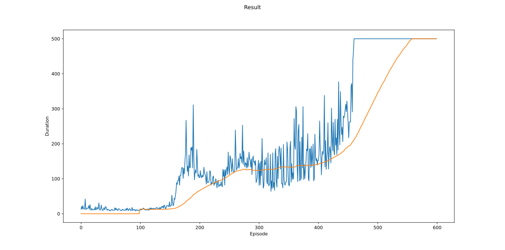
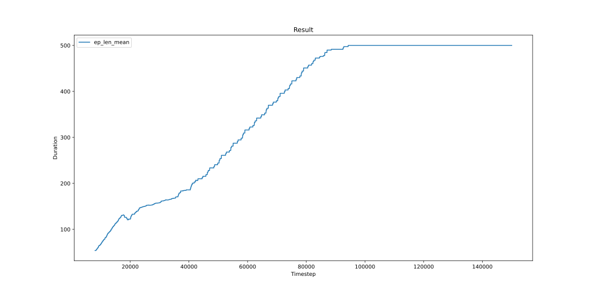

+++
title = "CartPole Demo: Simple Experiments with RL"
date = "2024-10-26"

[taxonomies]
tags=["RL", "DRL", "Cartpole"]

[extra]
comment = true
+++

## Task Definition

The agent has to decide between two actions - moving the cart left or right - so that the pole attached to it stays upright and the cart doesn't move too far away from its origin.

### Rewards

In this task, rewards are +1 for every incremental timestep and the environment terminates if the pole falls over too far or the cart moves more than 2.4 units away from center.

Since the goal is to keep the pole upright for as long as possible, by default, a reward of +1 is given for every step taken, including the termination step. The default reward threshold is 500 for v1 and 200 for v0 due to the time limit on the environment.

> ***Note:***
> If sutton_barto_reward=True, then a reward of 0 is awarded for every non-terminating step and -1 for the terminating step. As a result, the reward threshold is 0 for v0 and v1.

### Actions

The agent can take 2 possible **discrete** actions:

1. `0`: Push cart to the left
1. `1`: Push cart to the right

### States/Observations

In the CartPole task, the agent has access to 4 real values representing the environment state:

- position: right is the positive direction
- position velocity
- angle: 0 when vertical, and clockwise(right) is positive direction
- angle velocity

with the following constraints:

| Index | Value | Min | Max |
| -- | -- | -- | -- |
| 0 | Cart Position         | -4.8                  | 4.8               |
| 1 | Cart Velocity         | -Inf                  | Inf               |
| 2 | Pole Angle            | ~ -0.418 rad (-24°)   | ~ 0.418 rad (24°) |
| 2 | Pole Angular Velocity | -Inf                  | Inf               |

Note: While the ranges above denote the possible values for observation space of each element, it is not reflective of the allowed values of the state space in an unterminated episode. Particularly:

  * The cart x-position (index 0) can be take values between (-4.8, 4.8), but the episode terminates if the cart leaves the (-2.4, 2.4) range.
  * The pole angle can be observed between (-.418, .418) radians (or ±24°), but the episode terminates if the pole angle is not in the range (-.2095, .2095) (or ±12°)

### Episode

The episode ends if any one of the following occurs:

    * Termination: Pole Angle is greater than ±12°
    * Termination: Cart Position is greater than ±2.4 (center of the cart reaches the edge of the display)
    * Truncation: Episode length is greater than 500 (200 for v0)

## Control Methods

In this blog we try to solve this task using 2 different methods, DQN and PPO.

### DQN-based

DQN trys to find a policy using quality function $Q(s,a): \text{State} \times \text{Action} \to \mathbb{R}$,

$$
    \pi(s) = \argmax_a Q(s, a)
$$

DQN is a implicit method which indirectly sovles this task by finding $Q(s,a)$ first.

DQN uses deep neural network to parameterize $Q(s,a)$, it takes states $s$ as network input, and outputs action values which is the expected return of taking each action given the current input.

To train a neural network, there should exist a loss for which NN to minimize with SGD(stochastic gradient descent). However CartPole sim env doesn't provide explicit groundtruth label for directly training. However we can construct a kind of pseudo groundtruth data with optimal Bellman equation:

$$
Q^\pi (s, a) = r + \gamma \max_{a'} Q^\pi (s', a')
$$

and the error $\delta$ (TD error) between the two sides of the equality can be used to train Q network:

$$
\delta = Q(s,a) − (r + \gamma \max_{a'} Q(s', a'))
$$

To improve training robustness against outliers, we will use Huber loss instead of un-weighted L2 loss for each data sample, so

$$
L(\delta) = \left\{
\begin{aligned}
    \frac{1}{2} \delta^2 & & \text{for $\delta$ $\le$ 1} \\
    \delta - \frac{1}{2} & & \text{otherwise} \\
\end{aligned}
\right.
$$

and the overall loss is: 
$L = \frac{1}{|\mathbf{B}|} \displaystyle\sum\limits_{(s,a,s',r) \in \mathbf{B}} L(\delta)$.

### PPO-based

Proximal Policy Optimization(PPO) is a policy-gradient(PG) algorithm which tries to directly solve the policy to maximise the expected return given some proximality constraints, and this makes PPO a fast and efficient method for online, on-policy reinforcement learning.

The expected return PG tries to optimize is

$$
\pi(s)
= \argmax_\pi R_t
= \argmax\limits_\pi
    \overbrace{\mathbb{E}_\pi \left[ \sum_{k=0} \gamma^k r_{t + k} \right]}^{\color{red}\mathcal{L}}
$$

and its gradient is

$$
\nabla_\theta \mathcal{L} = \mathbb{E}_{\pi_\theta} \left[
    \left( \sum_{k=0} \gamma^k r_{t + k} \right) \nabla_\theta \ln \pi_\theta
\right]
$$

PPO tries to optimize a clipped loss which is a pessimistic bound of return, where lower return estimates will be favored compared to higher ones. The formula of the loss is:

$$
L_{\theta_{new}} (s, a) = \min_{\theta_{new}}
    \left(
        \frac{\pi_{\theta_{new}}(s, a)}{\pi_{\theta_{old}}(s, a)} A^{\pi_{\theta_{old}}}(s, a)
        ,
        g(\epsilon, A^{\pi_{\theta_{old}}}(s, a))
    \right)
$$

where

$$
g(\epsilon, A) = \left\{
    \begin{aligned}
    (1 + \epsilon)A && A \ge 0 \\
    (1 - \epsilon)A && A \lt 0 \\
    \end{aligned}
\right.
$$

This loss ensures that whether the advantage is positive or negative, policy updates that would produce significant shifts from the previous configuration are being discouraged.

## Results

- **Training Efficiency**

    The training efficiency for DQN and PPO is as follows (window sliding averaged with `len == 100`):
    

        

        <figure>
            
            <figcaption>DQN Training Result</figcaption>
        </figure>
        

        

        <figure>
            
            <figcaption>PPO Training Result</figcaption>
        </figure>
        

    

- **Evaluation Samples**

    

        

            

            <video src="vids/cartpole_dpn_pt_0-episode-0.mp4" type="video/mp4" width=90% autoplay loop muted/>
            

            <!-- 

            <video src="vids/cartpole_dpn_pt_3-episode-0.mp4" type="video/mp4" width=90% autoplay loop muted/>
            
 -->
            

            <video src="vids/cartpole_dpn_pt_4-episode-0.mp4" type="video/mp4" width=90% autoplay loop muted/>
            

            <!-- 

            <video src="vids/cartpole_dpn_pt_7-episode-0.mp4" type="video/mp4" width=90% autoplay loop muted/>
            
 -->
            

            
            DQN Evaluation Sim
            
            

        

        

            

            <video src="vids/cartpole_ppo_sb3_0-episode-0.mp4" type="video/mp4" width=90% autoplay loop muted/>
            

            

            <video src="vids/cartpole_ppo_sb3_1-episode-0.mp4" type="video/mp4" width=90% autoplay loop muted/>
            

            

            
            PPO Evaluation Sim
            
            

        

    

## Discussion and Future Work

- Goal-Guided
- Accel with Reward Shaping
- MLP / Transformer / Mamba
- 3D CartPole (x -> xy -> xyz)
