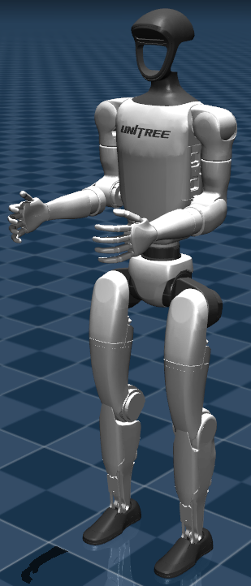
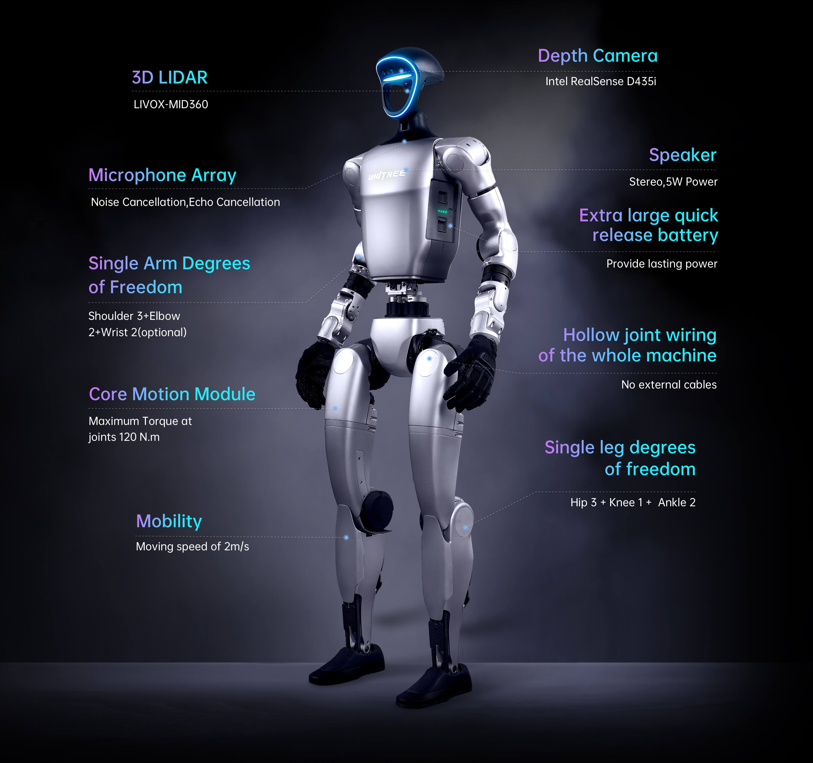
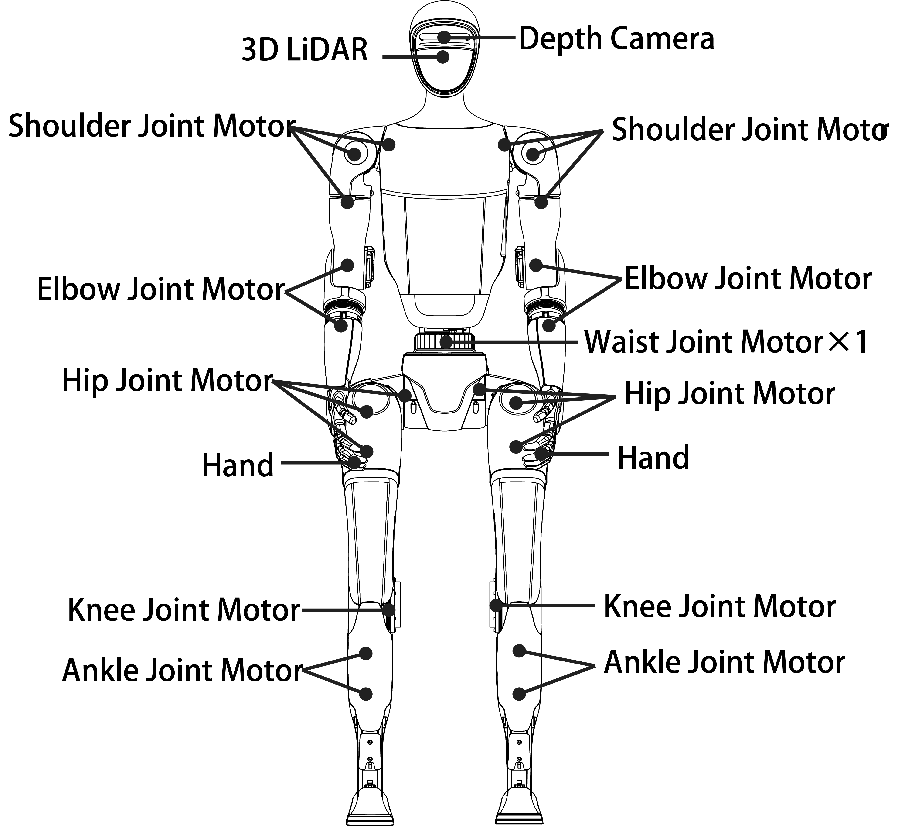
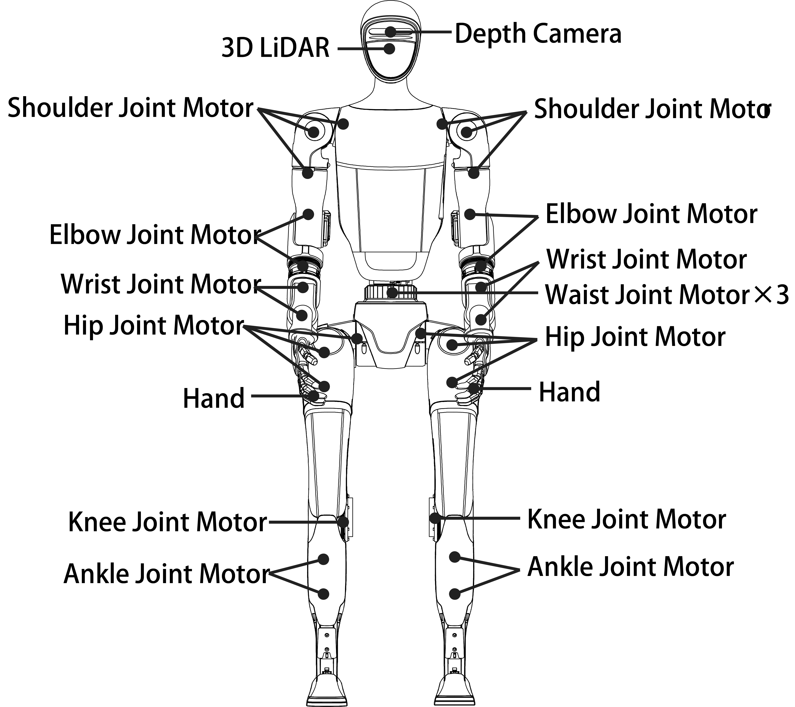
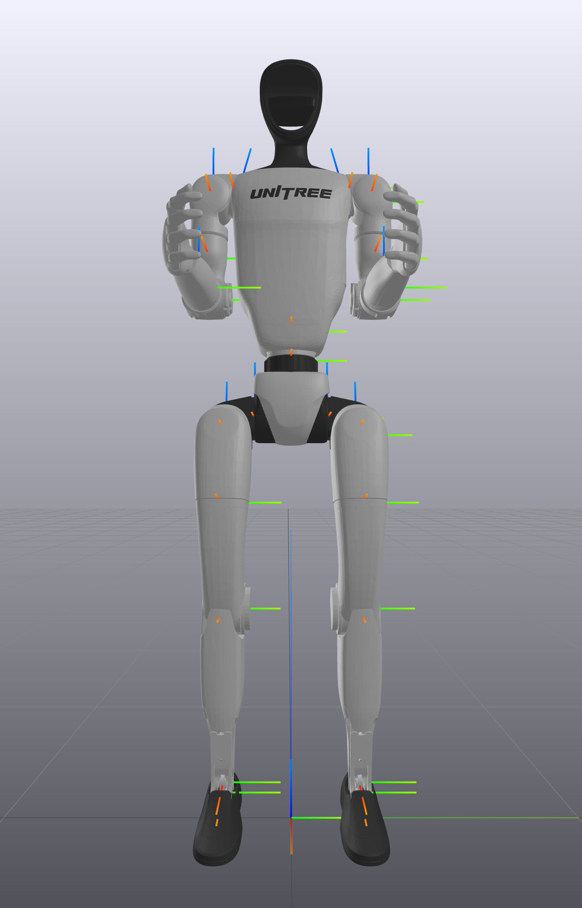
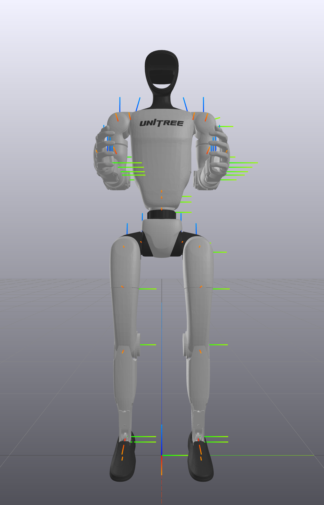
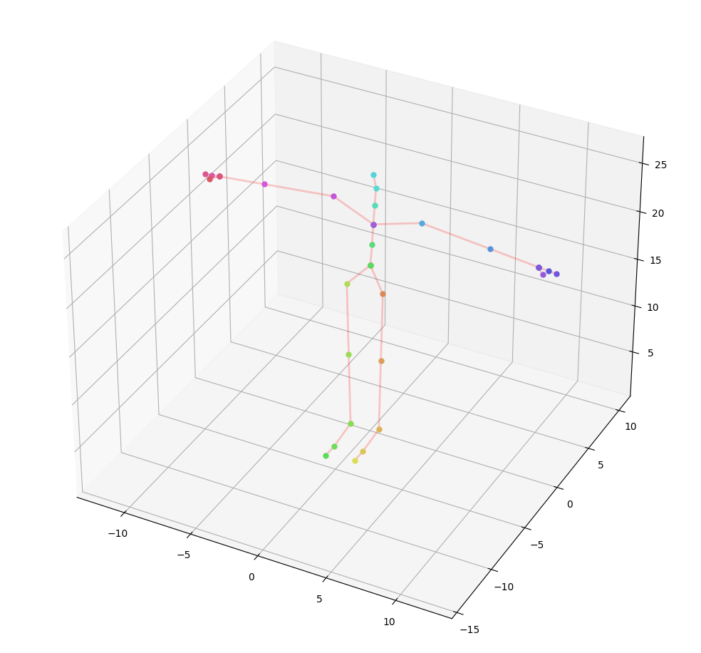
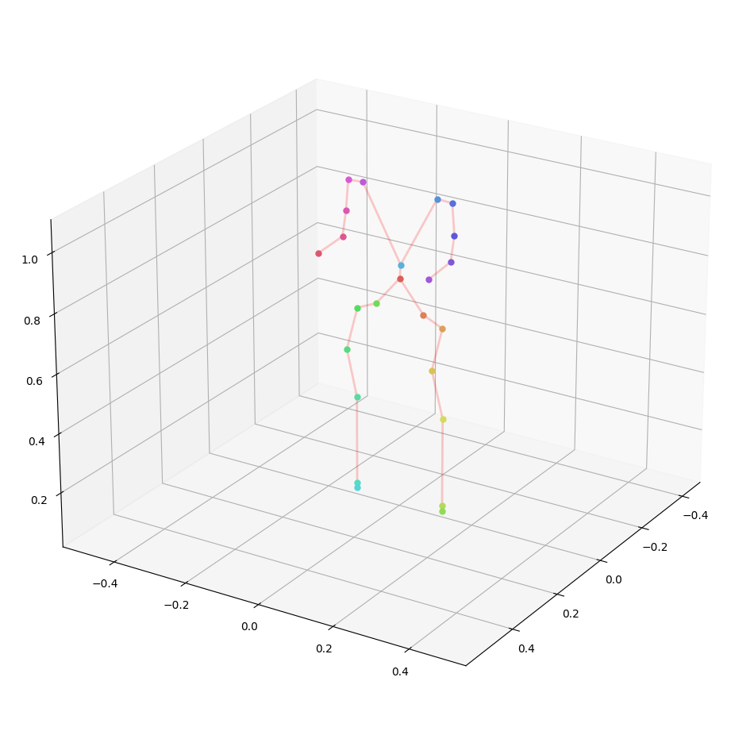

+++
title = "Humanoid Demo: Experiments with Unitree G1"
date = "2025-06-09"

[taxonomies]
tags=["RL", "DRL", "IL", "GAIL", "AIRL", "Bipedal", "Biped", "Humanoid", "Unitree/G1", "IsaacGym"]

[extra]
comment = true
+++

## Introduction

In this blog, we will conduct some experiments on [Unitree G1](https://www.unitree.com/g1). Specifically, using ***RL + IL*** and ***Motion Retargeting*** from the [CMU MoCap](https://mocap.cs.cmu.edu/) dataset, we will attempt to teach Unitree G1 to run, jump, ...

<video width="60%" oncontextmenu="return false;" nocontrols autoplay loop muted disablepictureinpicture preload=metadata>
    <source src="{{ url(path="vids/Jun14_19-14-38_run.webm") }}" type="video/webm">
    Your browser does not support the video tag.
</video>

<!-- more -->

## Unitree G1 Spec

<figure>

</figure>

The <a href="https://support.unitree.com/home/en/G1_developer/about_G1" style="pointer-events: none">Unitree G1</a> has 2 versions(i.e., G1-basic and G1-edu), and its corresponding specifications are as follows:

| | G1 | G1-EDU |
| -- | -- | -- |
| Key Dimensions | 1320x450x200 mm | 1320x450x200 mm |
| Calf + Thigh Length | 0.6m | 0.6m |
| Arm Span | About 0.45M | About 0.45M |
| Total Degrees of Freedom   (Joint Freedom）| 23 | 23~43 |
| Single Leg Degrees of Freedom | 6 | 6 |
| Waist Degrees of Freedom | 1 | 1 + (Optional 2 additional waist degrees of freedom) |
| Single Arm Degrees of Freedom | 5 | 5 |
| Single Hand Degrees of Freedom | / | 7(Optional Force outrolled three-fingered dexterous hand Dex3-1) + 2(Optional 2 additional wrist degrees of freedom) |
| Joint motor | Low inertia high-speed internal rotor PMSM   (permanent magnet synchronous motor, better response speed and heat dissipation) | Low inertia high-speed internal rotor PMSM   (permanent magnet synchronous motor, better response speed and heat dissipation) |
| Maximum Torque of Knee Joint | 90N.m | 120N.m |
| Joint Angle Limits | Waist joint：Z±155°   Knee joint：0~165°   Hip joint：P±154°、R-30~+170°、Y±158° | Waist joint：Z±155°、X±45°、Y±30°   Knee joint：0~165°   Hip joint：P±154°、R-30~+170°、Y±158°   Wrist joint：P±92.5°、Y±92.5° |
| Sensor Configuration | Depth Camera(Intel RealSense D435i) + 3D LiDAR(LIVOX-MID360) | Depth Camera(Intel RealSense D435i) + 3D LiDAR(LIVOX-MID360) |
| Total Weight | About 35kg | About 35kg+ |

### Joints

Unitree G1 has 23(basic)/29(edu) total degrees of freedom(DOFs), where each arm possesses 5(basic)/7(edu) degrees of freedom, each leg has 6, and the waist features 1(basic)/3(edu) degree of freedom.

<figure>

<figcaption>
G1(<strong>basic</strong>) Joints
</figcaption>
</figure>

<figure>

<figcaption>
G1(<strong>edu</strong>) Joints
</figcaption>
</figure>

 

<figure>

<figcaption>
<a href="https://doc-cdn.unitree.com/static/2024/9/14/1dcad03430904e14aec140c9e7e1e981_1304x2033.png" style="pointer-events: none">
G1(<strong>basic</strong>) Joint Coordinates
</a>
</figcaption>
</figure>

<figure>

<figcaption>
<a href="https://doc-cdn.unitree.com/static/2024/9/14/24b7205f093d45918fcce5459931e3a8_1304x2033.png" style="pointer-events: none">
G1(<strong>edu</strong>) Joint Coordinates
</a>
</figcaption>
</figure>

**Joint Numbering and Joint Limits**

<table style="font-size:60%;">

<tr>
    <th style="text-align:center; vertical-align:top;"> G1(<strong>basic</strong>) </th>
    <th style="text-align:center; vertical-align:top;"> G1(<strong>edu</strong>) </th>
</tr>

<tr style="padding:0;border-spacing:0;">

<td style="text-align:center;vertical-align:top;border:0px;border-collapse:collapse;">

| Joint Name | Limits | Joint Number |
| -- | -- | -- |
| {left,right}_hip_pitch_joint   `{L,R}_LEG_HIP_PITCH` | -2.5307~2.8798 rad | left: 0   right: 6 |
| left_hip_roll_joint   `L_LEG_HIP_ROLL` | -0.5236~2.9671 rad | 1 |
| right_hip_roll_joint   `R_LEG_HIP_ROLL` | -2.9671~0.5236 rad | 7 |
| {left,right}_hip_yaw_joint   `{L,R}_LEG_HIP_YAW` | -2.7576~2.7576 rad | left: 2   right: 8 |
| {left,right}_knee_joint   `{L,R}_LEG_KNEE` | -0.087267~2.8798 rad | left: 3   right: 9 |
| {left,right}_ankle_pitch_joint   `{L,R}_LEG_ANKLE_PITCH` | -0.87267~0.5236 rad | left: 4   right: 10 |
| {left,right}_ankle_roll_joint   `{L,R}_LEG_ANKLE_ROLL` | -0.2618~0.2618 rad | left: 5   right: 11 |
| waist_yaw_joint   `WAIST_YAW` | -2.618~2.618 rad | 12 |
| {left,right}_shoulder_pitch_joint   `{L,R}_SHOULDER_PITCH` | -3.0892~2.6704 rad | left:13   right: 18 |
| left_shoulder_roll_joint   `L_SHOULDER_ROLL` | -1.5882~2.2515 rad | 14 |
| right_shoulder_roll_joint   `R_SHOULDER_ROLL` | -2.2515~1.5882 rad | 19 |
| {left,right}_shoulder_yaw_joint   `{L,R}_SHOULDER_YAW` | -2.618~2.618 rad | left:15   right: 20 |
| {left,right}_elbow_joint   `{L,R}_ELBOW` | -1.0472~2.0944 rad | left: 16   right: 21 |
| {left,right}_wrist_roll_joint   `{L,R}_WRIST_ROLL` | -1.972222054~1.972222054 rad | left: 17   right: 22 |

</td>

<td style="text-align:center;vertical-align:top;border:0px;border-collapse:collapse;">

| Joint Name | Limits | Joint Number |
| -- | -- | -- |
| {left,right}_hip_pitch_joint   `{L,R}_LEG_HIP_PITCH` | -2.5307~2.8798 rad | left: 0   right: 6 |
| left_hip_roll_joint   `L_LEG_HIP_ROLL` | -0.5236~2.9671 rad | 1 |
| right_hip_roll_joint   `R_LEG_HIP_ROLL` | -2.9671~0.5236 rad | 7 |
| {left,right}_hip_yaw_joint   `{L,R}_LEG_HIP_YAW` | -2.7576~2.7576 rad | left: 2   right: 8 |
| {left,right}_knee_joint   `{L,R}_LEG_KNEE` | -0.087267~2.8798 rad | left: 3   right: 9 |
| {left,right}_ankle_pitch_joint   `{L,R}_LEG_ANKLE_PITCH` | -0.87267~0.5236 rad | left: 4   right: 10 |
| {left,right}_ankle_roll_joint   `{L,R}_LEG_ANKLE_ROLL` | -0.2618~0.2618 rad | left: 5   right: 11 |
| waist_yaw_joint   `WAIST_YAW` | -2.618~2.618 rad | 12 |
| waist_roll_joint   `WAIST_ROLL` | -0.52~0.52 rad | 13 |
| waist_pitch_joint   `WAIST_PITCH` | -0.52~0.52 rad | 14 |
| {left,right}_shoulder_pitch_joint   `{L,R}_SHOULDER_PITCH` | -3.0892~2.6704 rad | left:15   right: 22 |
| left_shoulder_roll_joint   `L_SHOULDER_ROLL` | -1.5882~2.2515 rad | 16 |
| right_shoulder_roll_joint   `R_SHOULDER_ROLL` | -2.2515~1.5882 rad | 23 |
| {left,right}_shoulder_yaw_joint   `{L,R}_SHOULDER_YAW` | -2.618~2.618 rad | left:17   right: 24 |
| {left,right}_elbow_joint   `{L,R}_ELBOW` | -1.0472~2.0944 rad | left: 18   right: 25 |
| {left,right}_wrist_roll_joint   `{L,R}_WRIST_ROLL` | -1.972222054~1.972222054 rad | left: 19   right: 26 |
| {left,right}_wrist_pitch_joint   `{L,R}_WRIST_PITCH` | -1.614429558~1.614429558 rad | left: 20   right: 27 |
| {left,right}_wrist_yaw_joint   `{L,R}_WRIST_YAW` | -1.614429558~1.614429558 rad | left: 21   right: 28 |

</td>

</tr>

</table>

## Reference Motion Retargeting

The skeleton model (henceforth referred to as 'CMU-MoCap') used in the CMU MoCap dataset and the robot model of Unitree G1 have different proportions and skeletal structures. Therefore, to reuse the MoCap animation dataset for Unitree G1, the technique called retargeting is needed. Retargeting is the process of adapting the animation from the source to the target character. Furthermore, humanoid retargeting is the process of transferring animation data from one humanoid character (the source) to another (the target).

Motion retargeting requires a consistent starting point for transferring animation accurately, and the T-pose serves this purpose. T-pose is a neutral, standardized pose (arms outstretched, resembling the letter 'T') used as a reference point(pose) for retargeting animations between different character skeletons. The following shows the T-pose for CMU-MoCap and Unitree-G1 respectively,

<figure>

<figcaption>

T-pose for CMU MoCap dataset   <em>&nbsp</em>

</figcaption>
</figure>

<figure>

<figcaption>

T-pose for Unitree G1   <em>(with upper body fixed)</em>

</figcaption>
</figure>

The final retargeted motions for Unitree G1 from CMU MoCap reference motions are as follows,

| | CMU MoCap | Unitree G1 |
| -- | -- | -- |
| RUN | <video src="vids/cmu_run_skeleton_motion.webm" type="video/webm" width=90% oncontextmenu="return false;" controls autoplay loop muted disablepictureinpicture preload=metadata/> | <video src="vids/unitree-g1_09_11_cmu_run_crop_600x500_500x250.webm" width=90% oncontextmenu="return false;" controls autoplay loop muted disablepictureinpicture preload=metadata/> |
| JUMP | <video src="vids/cmu_jump_skeleton_motion.webm" type="video/webm" width=90% oncontextmenu="return false;" controls autoplay loop muted disablepictureinpicture preload=metadata/> | <video src="vids/unitree-g1_01_01_jump_crop_600x500_500x250.webm" width=90% oncontextmenu="return false;" controls autoplay loop muted disablepictureinpicture preload=metadata/> |

## Experiments

- **RUN**

    

    

        <video src="vids/Jun14_19-14-38_run.webm" width=90% oncontextmenu="return false;" controls autoplay loop muted disablepictureinpicture preload=metadata/>
    

    

- **JUMP**

    

    

        <video src="vids/Jun26_17-21-31_jump.webm" width=90% oncontextmenu="return false;" controls autoplay loop muted disablepictureinpicture preload=metadata/>
    

    

