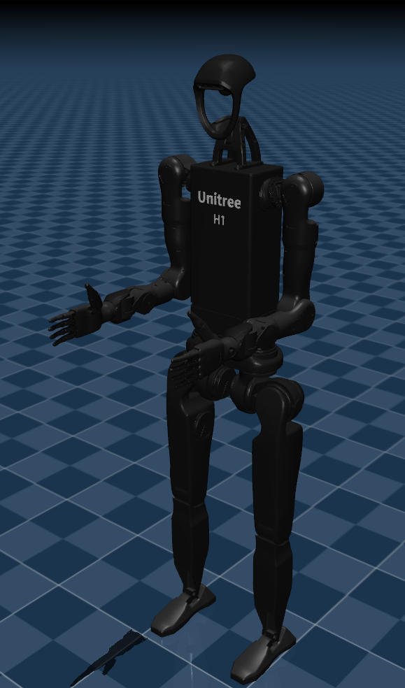
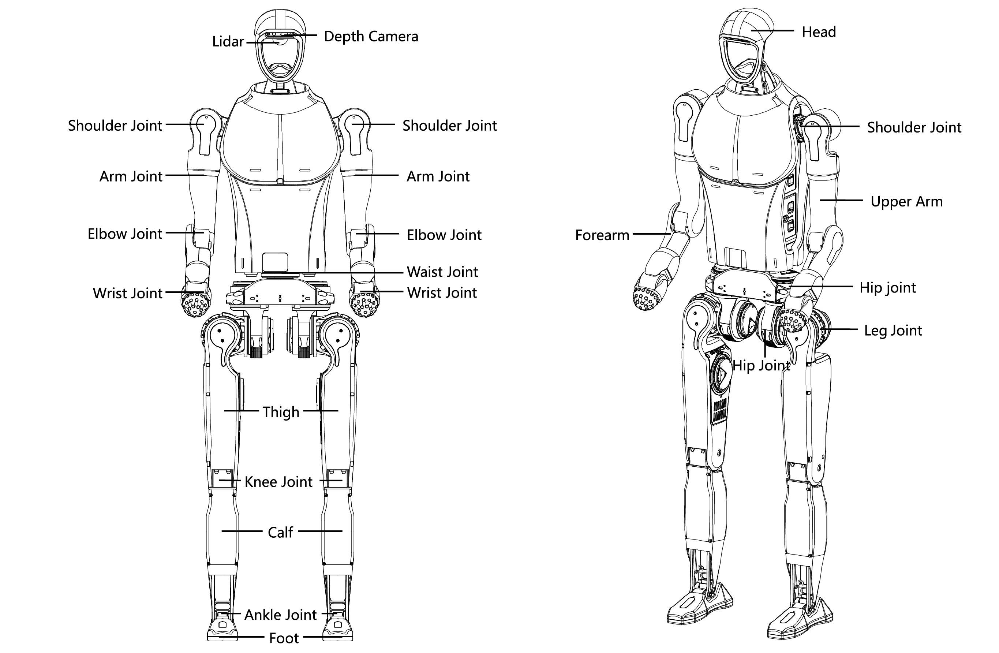
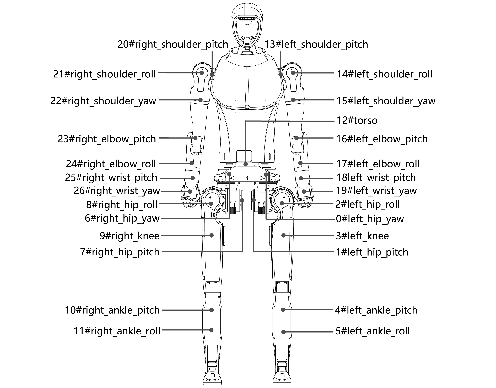
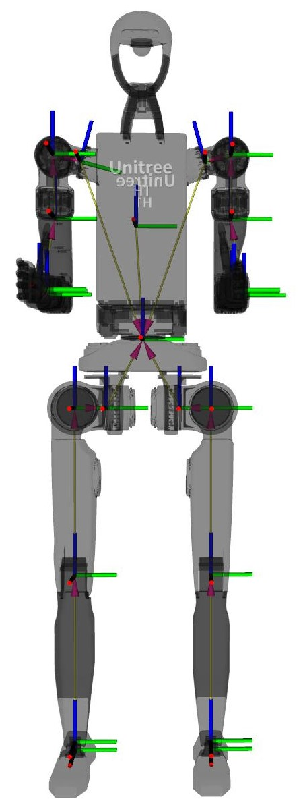

+++
title = "Humanoid Demo: Porting CPG to Unitree H1"
date = "2025-01-26"

[taxonomies]
tags=["RL", "DRL", "CPG", "Bipedal", "Biped", "Humanoid", "Unitree/H1", "Unitree/H1-2", "IsaacGym"]

[extra]
comment = true
+++

## Introduction

In this blog, we will attempt to adapt ***CPG + RL***, which was successfully applied to the 2D Gym BipedalWalker, to a real 3D bipedal humanoid model: the [Unitree H1-2](https://www.unitree.com/h1).

<video width="60%" oncontextmenu="return false;" nocontrols autoplay loop muted disablepictureinpicture preload=metadata>
    <source src="{{ url(path="vids/Mar02_18-37-35_test_cpgp_htDA_dofacc2.5_reghipfoot.fix_headobs_htDA_vxDA_nenv64.crop.webm") }}" type="video/webm">
    Your browser does not support the video tag.
</video>

<!-- more -->

## Unitree H1-2 Spec

<figure>

<figcaption>
<a href="https://doc-cdn.unitree.com/static/2024/9/4/9e873852c7e24cb7bbae7f19868483f8_2730x1784.png" style="pointer-events: none">
Unitree H1-2 Components
</a>
</figcaption>
</figure>

The <a href="https://support.unitree.com/home/en/H1_developer/About_H1-2" style="pointer-events: none">Unitree H1-2</a> is a humanoid robot based on the <a href="https://support.unitree.com/home/en/H1_developer/About_H1" style="pointer-events: none">Unitree H1</a> model, boasting enhanced motion capability and degrees of freedom. A comparison of specifically concerned parameters between H1 and H1-2 is shown below:

| | H1 | H1-2 |
| -- | -- | -- |
| Key Dimensions | (1520+285)mm × 570mm × 220mm | (1503+285)mm × 510mm × 287mm |
| Thigh and Calf Length | 400mm × 2 | 400mm × 2 |
| Total Arm Length | 338mm × 2 | 685mm |
| DOF of Each Leg | 5（Hip × 3 + Knee × 1 + Ankle × 1） | 6（Hip x 3 + Knee x 1 + Ankle x 2）|
| DOF of Each Arm | 4（Expandable） | 7（Shoulder x 3 + Elbow x 1 + Wrist x 3）|
| Core Joint motor | Low inertia high-speed internal rotor PMSM   (permanent magnet synchronous motor, better response speed and heat dissipation) | Low inertia high-speed internal rotor PMSM   (permanent magnet synchronous motor, better response speed and heat dissipation) |
| Ultimate Torque of Joint Unit | Knee Torque About 360N.m   Hip Joint Torque About 220N.m   Ankle Torque About 59N.m   Arm Joint Torque About 75N.m   Arm joint approximately 75N.m | Knee Torque About 360N.m   Hip Joint Torque About 220N.m   Waist Joint About 220N.m   TBD: ~~Ankle Joint About 75x2N.m~~ ~~(Ankle joint approximately 45N.m)~~   Arm joint approximately 75N.m |
| Dexterous Hand | Optional | Optional RH56 or other ambidextrous hands |
| Arm joint performance   (peak torque) | / | Shoulder: About 120N.m   Elbow: About 120N.m   Wrist: About 30N.m |
| Mobility | Moving speed of 3.3m/s   Potential mobility > 5m/s | Moving speed of 3.3m/s, Potential mobility > 5m/s |
| Sensor Configuration | 3D LIDAR + Depth Camera | 3D LIDAR + Depth Camera |
| Total Weight | ~ 47kg | ~ 70kg |

### Joints

Each arm of the H1-2 possesses 7 degrees of freedom, each leg has 6, and the waist features 1 degree of freedom, culminating in a total of 27 degrees of freedom across the entire machine.

<figure>

<figcaption>
<a href="https://doc-cdn.unitree.com/static/2024/9/3/3a458dbbd548408fbf66099cca4e1f66_3876x3035.png" style="pointer-events: none">
H1-2 Joint Numbering
</a>
</figcaption>
</figure>

<figure>

<figcaption>

<a href="https://doc-cdn.unitree.com/static/2024/9/5/928eea81692d486b82ae056f2a7865f4_450x1190.jpg" style="pointer-events: none">
H1-2 Joint Coordinate System
</a>
 

<b>red axis -> x-axis</b>
 
<b>green axis -> y-axis</b>
 
<b>blue axis -> z-axis</b>

</figcaption>
</figure>

**Joint Numbering and Joint Limits**

| Joint Name | Limits | Joint Number |
| -- | -- | -- |
| {left,right}_hip_yaw | -0.43~+0.43 rad | left: 0, right: 6 |
| {left,right}_hip_pitch | -3.14~+2.5 rad | left: 1, right: 7 |
| left_hip_roll | -0.43~+3.14 rad | 2 |
| right_hip_roll | -3.14~+0.43 rad | 8 |
| {left,right}_knee | -0.26~+2.05 rad | left: 3, right: 9 |
| {left,right}_ankle_pitch | -0.897334~+0.523598 rad | left: 4, right: 10 |
| {left,right}_ankle_roll | -0.261799~+0.261799 rad | left: 5, right: 11 |
| torso | -3.14~+1.57 rad | 12 |
| left_shoulder_pitch | -3.14~+1.57 rad | 13 |
| right_shoulder_pitch | -1.57~+3.14 rad | 20 |
| left_shoulder_roll | -0.38~+3.4 rad | 14 |
| right_shoulder_roll | -3.4~+0.38 rad | 21 |
| left_shoulder_yaw | -3.01~+2.66 rad | 15 |
| right_shoulder_yaw | -2.66~+3.01 rad | 22 |
| left_elbow_pitch | -2.53~+1.6 rad | 16 |
| right_elbow_pitch | -1.6~+2.53 rad | 23 |
| {left,right}_elbow_roll | -2.967~+2.967 rad | left: 17, right: 24 |
| {left,right}_wrist_pitch | -0.471~+0.349 rad | left: 18, right: 25 |
| {left,right}_wrist_yaw | -1.012~+1.012 rad | left: 19, right: 26 |

## Key Changes

The training almost failed when directly applying the CPG model, although that worked well for the BipedalWalker, to the Unitree H1 series humanoid robots. This may be attributed to:

- Complexity of Space Dimension: simulation for BipedalWalker with Box2D physical engine is 2D, while simulation for Unitree-H1 Series using Nvidia IsaacGym is 3D.
- Number of Joints: BipedalWalker has total 4 joints for 2 legs(each has 2(1xhip + 1xknee) joints), while Unitree H1 has 10 joints in lower body part for 2 legs(each has 5(3xhip + 1xknee + 2xankle) joints), and Unitree H1-2 has 12 joints in lower body part for 2 legs (each has 6(3xhip + 1xknee + 3xankle) joints).
- COM(center of mass) of Body: BipedalWalker has lower position of COM due to its horizontally placed slim hull, while Unitree H1 Series Humanoids has higher position of COM since with a vertically long torso. And position of COM has large impact on maintaining stability.
- Motor Controller: Although both BipedalWalker and Unitree H1-Series are using PD as low-level motor controller, these 2 types of motor have significantly different electrical/mechanical characteristics. The controller of BipedalWalker has faster response time and good tracking accuracy (not perfect but usable), while the default controller used by Unitree H1-series has slower response time and pretty bad tracking accuracy.

To overcome the aforementioned problems when adapting to the Unitree H1/H1-2, several important modifications were made to achieve successful training:

- CPG Model Optimization: to avoid learning degenerated pattern during training, some steps are taken, including specific initialization logic, proper action design, CPG pattern regulation, etc.
- Hybrid Joint Controller: since Unitree H1/H1-2's default P-type motor controller is unusable for this task as described above, here we introduce a hybrid(torque + angle) control method.

## Experiments

- **Fixed CPG height $=1.85$**

    

    

        <video src="vids/Feb18_15-39-54_cpgp_pnR_f.p3_gc0.3_gp0.01_ct2jtnorew_pdresrewn_alive3.0_nenv4096_Tctl_ht1.85_vx0.3.crop_w600_h500_x500_y200.webm" width=90% oncontextmenu="return false;" controls autoplay loop muted disablepictureinpicture preload=metadata/>
    

    

        <video src="vids/Feb18_15-39-54_cpgp_pnR_f.p3_gc0.3_gp0.01_ct2jtnorew_pdresrewn_alive3.0_nenv4096_Tctl_ht1.85_vx0.8.crop_w600_h500_x500_y200.webm" width=90% oncontextmenu="return false;" controls autoplay loop muted disablepictureinpicture preload=metadata/>
    

    

        <video src="vids/Feb18_15-39-54_cpgp_pnR_f.p3_gc0.3_gp0.01_ct2jtnorew_pdresrewn_alive3.0_nenv4096_Tctl_ht1.85_nenv64.crop.webm" width=90% oncontextmenu="return false;" controls autoplay loop muted disablepictureinpicture preload=metadata/>
    

    

- **Fixed CPG height $=1.60$**

    

    

        <video src="vids/Mar09_04-30-11_test_cpgp_sl0.4_htDA.1.6.1.9_dofacc2.5_reghipfoot_ent0.003_newCTJTrew_maxvelX1.0___ht1.6_vx0.3.crop_w600_h500_x500_y200.webm" width=90% oncontextmenu="return false;" controls autoplay loop muted disablepictureinpicture preload=metadata/>
    

    

        <video src="vids/Mar09_04-30-11_test_cpgp_sl0.4_htDA.1.6.1.9_dofacc2.5_reghipfoot_ent0.003_newCTJTrew_maxvelX1.0___ht1.6_vx0.8.crop_w600_h500_x500_y200.webm" width=90% oncontextmenu="return false;" controls autoplay loop muted disablepictureinpicture preload=metadata/>
    

    

        <video src="vids/Feb19_16-18-36_cpgp_pnR_f.p3_gc0.3_gp0.01_ht1.65_ct2jtnorew_pdresrewn_alive3.0_nenv4096_Tctl_ht1.65_nenv64.crop.webm" width=90% oncontextmenu="return false;" controls autoplay loop muted disablepictureinpicture preload=metadata/>
    

    

- **CPG Height + Body Velocity Adjustment On-the-fly**

    

    

        

        <video src="vids/Mar09_04-30-11_test_cpgp_sl0.4_htDA.1.6.1.9_dofacc2.5_reghipfoot_ent0.003_newCTJTrew_maxvelX1.0___htDA_vx0.8.crop_w600_h500_x500_y200.webm" width=90% oncontextmenu="return false;" controls autoplay loop muted disablepictureinpicture preload=metadata/>
        

        

            <strong>
            Dynamic Height, Fixed Speed
            </strong>
        

    

    

        

        <video src="vids/Mar09_04-30-11_test_cpgp_sl0.4_htDA.1.6.1.9_dofacc2.5_reghipfoot_ent0.003_newCTJTrew_maxvelX1.0___ht1.75_vxDA.crop_w600_h500_x500_y200.webm" width=90% oncontextmenu="return false;" controls autoplay loop muted disablepictureinpicture preload=metadata/>
        

        

            <strong>
            Dynamic Speed, Fixed Height
            </strong>
        

    

    

        

        <video src="vids/Mar02_18-37-35_test_cpgp_htDA_dofacc2.5_reghipfoot.fix_headobs_htDA_vxDA_nenv64.crop.webm" width=90% oncontextmenu="return false;" controls autoplay loop muted disablepictureinpicture preload=metadata/>
        

        

            <strong>
            Dynamic Speed, Dynamic Height
            </strong>
        

    

    

