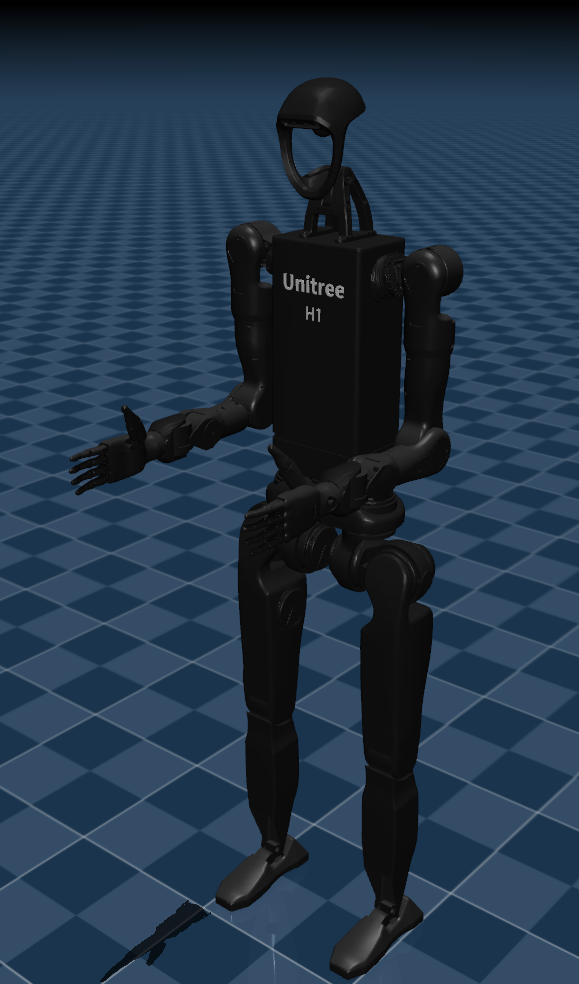
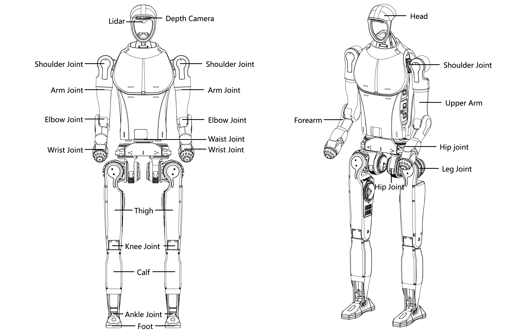
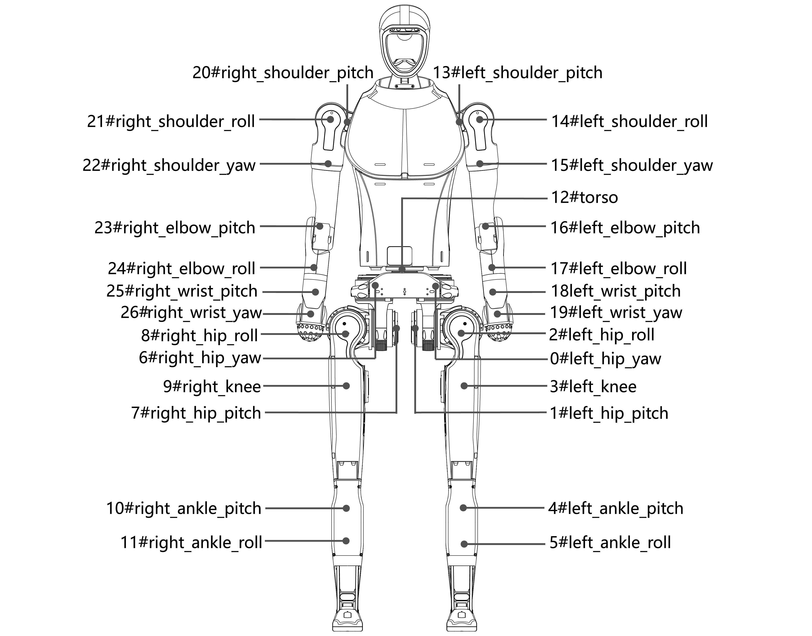
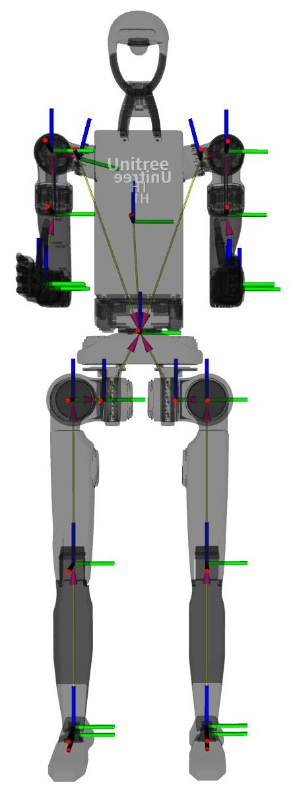

+++
title = "Humanoid Demo: Porting CPG to Unitree H1"
date = "2025-01-26"

[taxonomies]
tags=["RL", "DRL", "Bipedal", "Biped", "Humanoid", "Unitree-H1", "IsaacGym"]

[extra]
comment = true
+++

## Introduction

In this Blog we will adapt CPG to a real bipedal Humanoid model [Unitree H1-2](https://www.unitree.com/h1).

<!-- more -->

## UniTree H1-2 Spec

<figure>

<figcaption>
<a href="https://doc-cdn.unitree.com/static/2024/9/4/9e873852c7e24cb7bbae7f19868483f8_2730x1784.png" style="pointer-events: none">
Unitree H1-2 Components
</a>
</figcaption>
</figure>

<a href="https://support.unitree.com/home/en/H1_developer/About_H1-2" style="pointer-events: none">Unitree H1-2</a> is a humanoid robot based on <a href="https://support.unitree.com/home/en/H1_developer/About_H1" style="pointer-events: none">Unitree H1</a> model, boasting enhanced motion capability and degrees of freedom. The comparison of concerned parameters between H1 and H1-2 is shown as follows:

| | H1 | H1-2 |
| -- | -- | -- |
| Key Dimensions | (1520+285)mm × 570mm × 220mm | (1503+285)mm × 510mm × 287mm |
| Thigh and Calf Length | 400mm × 2 | 400mm × 2 |
| Total Arm Length | 338mm × 2 | 685mm |
| DOF of Each Leg | 5（Hip × 3 + Knee × 1 + Ankle × 1） | 6（Hip x 3 + Knee x 1 + Ankle x 2）|
| DOF of Each Arm | 4（Expandable） | 7（Shoulder x 3 + Elbow x 1 + Wrist x 3）|
| Core Joint motor | Low inertia high-speed internal rotor PMSM   (permanent magnet synchronous motor,better response speed and heat dissipation) | Low inertia high-speed internal rotor PMSM   (permanent magnet synchronous motor,better response speed and heat dissipation) |
| Ultimate Torque of Joint Unit | Knee Torque About 360N.m   Hip Joint Torque About 220N.m   Ankle Torque About 59N.m   Arm Joint Torque About 75N.m   Arm joint approximately 75N.m | Knee Torque About 360N.m   Hip Joint Torque About 220N.m   Waist Joint About 220N.m   TBD: ~~Ankle Joint About 75x2N.m~~ ~~(Ankle joint approximately 45N.m)~~   Arm joint approximately 75N.m |
| Dexterous Hand | Optional | Optional RH56 or other ambidextrous hands |
| Arm joint performance   (peak torque) | / | Shoulder: About 120N.m   Elbow: About 120N.m   Wrist: About 30N.m |
| Mobility | Moving speed of 3.3m/s   Potential mobility > 5m/s | Moving speed of 3.3m/s, Potential mobility > 5m/s |
| Sensor Configuration | 3D LIDAR + Depth Camera | 3D LIDAR + Depth Camera |
| Total Weight | ~ 47kg | ~ 70kg |

### Joints

Each arm of the H1-2 possesses 7 degrees of freedom, each leg has 6, and the waist features 1 degree of freedom, culminating in a total of 27 degrees of freedom across the entire machine.

<figure>

<figcaption>
<a href="https://doc-cdn.unitree.com/static/2024/9/3/3a458dbbd548408fbf66099cca4e1f66_3876x3035.png" style="pointer-events: none">
H1-2 Joint Numbering
</a>
</figcaption>
</figure>

<figure>

<figcaption>

<a href="https://doc-cdn.unitree.com/static/2024/9/5/928eea81692d486b82ae056f2a7865f4_450x1190.jpg" style="pointer-events: none">
H1-2 Joint Coordinate System
</a>
 

<b>red axis -> x-axis</b>
 
<b>green axis -> y-axis</b>
 
<b>blue axis -> z-axis</b>

</figcaption>
</figure>

**Joint Numbering and Joint Limits**

| Joint Name | Limits | Joint Number |
| -- | -- | -- |
| {left,right}_hip_yaw | -0.43~+0.43 rad | left: 0, right: 6 |
| {left,right}_hip_pitch | -3.14~+2.5 rad | left: 1, right: 7 |
| left_hip_roll | -0.43~+3.14 rad | 2 |
| right_hip_roll | -3.14~+0.43 rad | 8 |
| {left,right}_knee | -0.26~+2.05 rad | left: 3, right: 9 |
| {left,right}_ankle_pitch | -0.897334~+0.523598 rad | left: 4, right: 10 |
| {left,right}_ankle_roll | -0.261799~+0.261799 rad | left: 5, right: 11 |
| torso | -3.14~+1.57 rad | 12 |
| left_shoulder_pitch | -3.14~+1.57 rad | 13 |
| right_shoulder_pitch | -1.57~+3.14 rad | 20 |
| left_shoulder_roll | -0.38~+3.4 rad | 14 |
| right_shoulder_roll | -3.4~+0.38 rad | 21 |
| left_shoulder_yaw | -3.01~+2.66 rad | 15 |
| right_shoulder_yaw | -2.66~+3.01 rad | 22 |
| left_elbow_pitch | -2.53~+1.6 rad | 16 |
| right_elbow_pitch | -1.6~+2.53 rad | 23 |
| {left,right}_elbow_roll | -2.967~+2.967 rad | left: 17, right: 24 |
| {left,right}_wrist_pitch | -0.471~+0.349 rad | left: 18, right: 25 |
| {left,right}_wrist_yaw | -1.012~+1.012 rad | left: 19, right: 26 |

