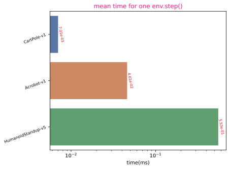
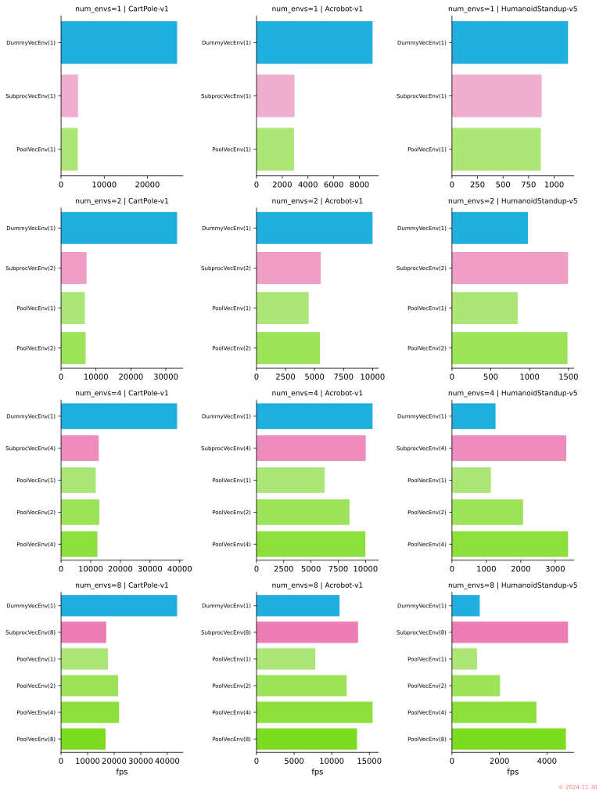
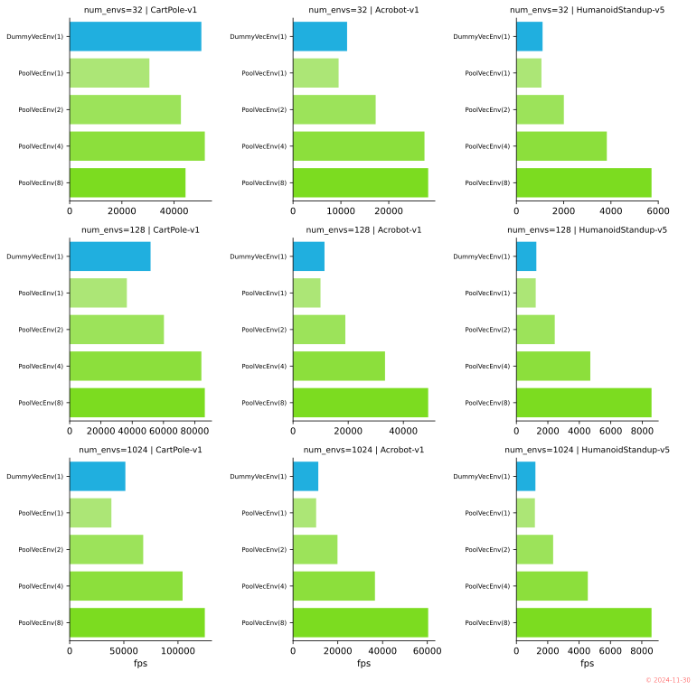
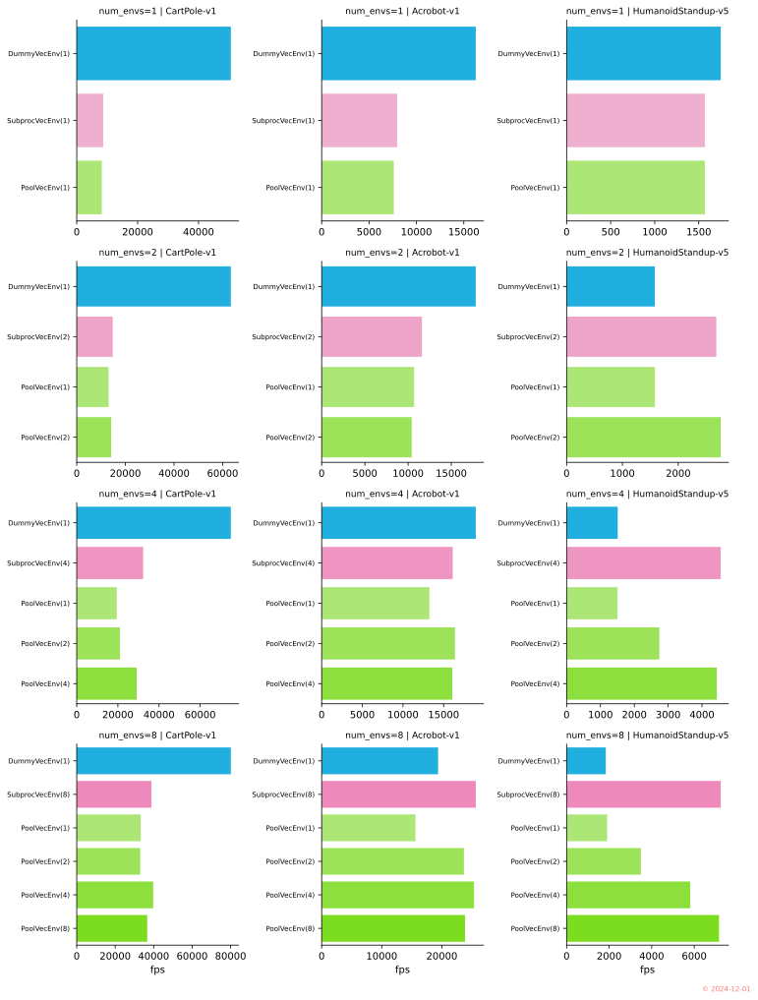

+++
title = "Accelerating Simulation of Stable Baselines3's VecEnv in Multi-Core Processor"
date = "2024-11-30"

[taxonomies]
tags=["RL", "DRL", "SB3", "Stable-Baselines", "Stable-Baselines3"]

[extra]
comment = true
+++

## Background

Stable-baselines3 (SB3) is a popular library for rapid prototype development of RL algorithm, it ships with many common model-free algorithms out of the box. SB3 requires vectorized environment `VecEnv` as input interface to its built-in RL algorithms for allowing training on multiple environments, it provides two class `DummyVecEnv` and `SubprocVecEnv`. However both `DummyVecEnv` and `SubprocVecEnv` has obvious drawbacks for leveraging the capacity of multi-core processor for simulating large number of environments. In this blog we implement a new `PoolVecEnv` which draws inspiration from ThreadPool/ProcessPool for accelerating large number of environments simulation. ***Modified Code will be available on [Github](https://github.com/drl-test/stable-baselines3) later***

<!-- more -->

## Introduction

SB3 currently has two built-in vectorized env class, `DummyVecEnv` and `SubprocVecEnv`,
<!-- parallelism / parallelization -->

- `DummyVecEnv` is simple vectorized wrapper for simulating multiple environments sequentially, which runs on the current process of the caller and calls each gym environment in sequence, so it is useful for tasks with small number of computationally simple environment, e.g., `CartPole-v1[gym]`.

- `SubprocVecEnv` is a multiprocess vectorized wrapper for multiple environments parallel simulation, it distributes each env simulation to different processor, so can achieve true parallelism and make full use of multi-processor's power. However it has the communication cost between multiprocess or multithread, which may outweigh the actual environment computation time for simple tasks. `SubprocVecEnv` allows significantly speed up if the environment is computationally intensive like video games.

Here is the problem, which one of the above is best suitable for simulating large number of simple environments? `DummyVecEnv` may be too slow for this case as it only uses one process core, while `SubprocVecEnv` will introduce significant overhead from large number of running process, including cost of both communication and context switch of process/thread. Inspired by Pool-based multi-task processing, we implement a `PoolVecEnv` which makes full of multiprocess compared to `DummyVecEnv` and also avoids overhead of large (> cores) running process compared to `SubprocVecEnv`.

## Experiments

<!--
**Performance Metrics**
- Throughput: The number of tasks that can be completed per unit of time
- Latency: The time it takes for a task to be processed and finished

- <https://github.com/odygrd/quill?tab=readme-ov-file#-performance>
- <https://github.com/odygrd/quill/tree/master/scripts>
-->

Three gym environments are chosen for evaluation, `CartPole-v1`, `Acrobot-v1`, and `HumanoidStandup-v5`, which require different computation for small to large as follows:

<!--
TODO: single click to zoom image
- [Implement click-to-zoom option for images #46260](https://github.com/kubernetes/website/pull/46260)
- [How can I make images clickable so I can zoom them to full screen?](https://discourse.gohugo.io/t/how-can-i-make-images-clickable-so-i-can-zoom-them-to-full-screen/34279)
-->

<figure>
    <!-- <a href="imgs/benchmark_env_info.svg" target="_self"> -->
    
    <!-- </a> -->
    <figcaption></figcaption>
</figure>

We use throughput as the main index for evaluating performance of these 3 methods, here throughput is defined as the total number of `env.step()` executed per unit time (1s).

`DummyVecEnv` always uses 1-CPU, `SubprocVecEnv` uses `min(num_cpus, num_envs)` CPUs, while `PoolVecEnv` will use user specified (***MUST `<num_cpus`***) number of CPUs.

#### Case1: [AMD EPYC 7K62](https://www.cpubenchmark.net/cpu.php?cpu=AMD+EPYC+7K62&id=4859), ***[2020, 48-Core, 96-Thread]***

In this trial, we use a cloud virtual machine which physically has 96 virtual CPUs, but only **12 CPUs** of those are allocated to our computing instance. for convenience of comparison, we further restrict it to ***8 CPUs*** for all `DummyVecEnv`, `SubprocVecEnv` and `PoolVecEnv`.

    <!-- 
 -->
    

    
    

    <!-- 
 -->
    

    
    

    

    

    <!--  -->
    
    <b>AMD EPYC 7K62</b>
    
    

    

In the first figure the number of environments is less or equal than the number of CPUs, so both `DummyVecEnv`, `SubprocVecEnv` and `PoolVecEnv` can work with their maximum capacity. From top to bottom, the number of environments increases, while from left to right, the complexity of environments increases. A approximate formula can be used to describe the efficiency of `SubprocVecEnv` and `PoolVecEnv` compared to `DummyVecEnv` as a function of the number of environments ($N$) and the complexity of the environment ($t_{\text{env}}$):


$$
\frac{fps_{\text{Subproc|Pool}}}{fps_{\text{Dummy}}} \approx \frac{N * t_{\text{env}}}{N * t_{\text{env}} + t_{\text{os}}}
$$


It can be seen both `SubprocVecEnv` and `PoolVecEnv` introduce some overheads compared to `DummyVecEnv`, especially for one environment simulation case which is the top row of `fig1`. As the complexity of environment increases ($t_{\text{env}} \uparrow$), the overhead ratio decreases. And with more environments, the less significant of the overhead will be.

Furthermore, with same number of CPUs, `PoolVecEnv` achieves similar performance to `SubprocVecEnv`, which is desirable as both utilize all the allocated CPUs's power.

In the second figure the number of environments is greater than the number of CPUs, and `SubprocVecEnv`'s performance degrades rapidly as the number of processes increases when exceeding the number of CPUs, so we omit it and only compare `DummyVecEnv` and `PoolVecEnv`. The relationship between efficiency and complexity of the environment shown in the second figure is the same as result seen in the first figure. Besides the performance increases approximately linearly with the number of CPUs `PoolVecEnv` can use, which is the goal that `PoolVecEnv` tries to reach. 

#### Case2: [AMD Ryzen5 5600X](https://www.cpubenchmark.net/cpu.php?cpu=AMD+Ryzen+5+5600X&id=3859), ***[2020, 6-Core, 12-Thread]***

    <!-- 
 -->
    

    
    

    <!-- 
 -->
    

    
    

    

    

    <!--  -->
    
    <b>AMD Ryzen5 5600X</b>
    
    

    

#### Case3: [12th Gen Intel(R) Core(TM) i5-12490F](https://www.cpubenchmark.net/cpu.php?id=4903&cpu=Intel+Core+i5-12490F), ***[2022, 6-Core, 12-Thread]***

<em><strong>TODO</strong></em>

